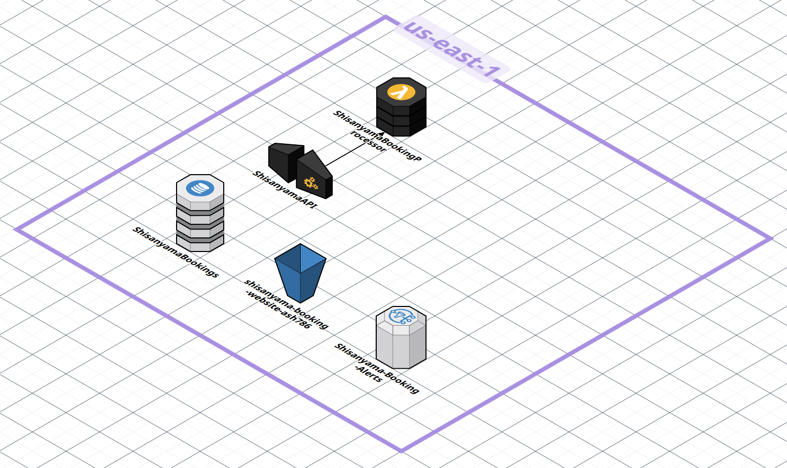

# ☁️ AWS Cloud Migration Proposal & Architectural Handover

<div align="center">

[](#briefing)
[](#bottlenecks)
[](#video-pitch)
[](#architecture)
[](#portal)
[](#financials)
[](#results)

</div>

> [!NOTE]
> **📋 Project:** AWS Serverless Migration for Shisanyama Operational Ecosystem  
> **👨‍💻 Prepared By:** Solutions Architect & Delivery Lead  
> **🎯 Prepared For:** Executive Board of Directors (MD & CFO)  
> **🏁 Status:** Production-Ready / Handover Stage  

---

<a name="briefing"></a>
## 📋 Executive Briefing

This document outlines the production-ready technical architecture designed to transition current manual operational hurdles—such as lost double-bookings and kitchen friction—into a scalable, high-performing digital ecosystem. By leveraging managed AWS cloud services, we aim to secure data, optimize the customer experience, and reduce long-term operational overhead.

---

<a name="bottlenecks"></a>
## 1. 🔴 The Business Problem: Operational Bottlenecks

> [!CAUTION]
> **Legacy On-Premises Risk Exposure**  
> Current reliance on physical processes creates direct financial and operational vulnerabilities during high-volume trading hours.

* 📝 **Manual Dependency:** Total reliance on fragile physical paper ledger records or a single standalone localized administrative computer terminal prone to physical damage.
* 🎟️ **Order Mix-Ups:** Frequent manual tracking mistakes resulting directly in kitchen order mix-ups, missing ticket items, and disruptive double-booked reservation slots.
* 🔒 **Siloed Customer Data:** Complete lack of a centralized datastore, making it impossible to securely save repeat customer preferences or issue formal order confirmations.
* 📈 **Inability to Scale:** Expanding processing capacity requires high physical staffing expenditures or local compute hardware upgrades instead of fluid automation.

---

<a name="video-pitch"></a>
## 2. 🎥 Media Pitch Briefing (Video Demo)

> [!IMPORTANT]
> **Executive Presentation Walkthrough**  
> Below is the presentation video pitch showcasing the conceptual transformation from manual limitations directly into a managed AWS serverless environment:

[https://github.com/user-attachments/assets/140af033-4fbe-45eb-ab15-5b4f54d7b528](https://github.com/user-attachments/assets/140af033-4fbe-45eb-ab15-5b4f54d7b528)

> 🎬 **Note:** Click play above to stream the full video pitch with audio directly inside GitHub.

---

<a name="architecture"></a>
## 3. ⚡ Technical Solution & Cloud Ecosystem

Transitioning localized legacy bottlenecks into a highly available ecosystem of modern managed cloud service components to ensure platform auto-scaling and continuous availability:

<div align="center">



</div>

<br>

| AWS Service | Architecture Role | Business Value Delivered |
| :--- | :--- | :--- |
| **`Amazon S3`** | **Static Web Hosting** | Eliminates localized frontend dependencies by hosting web code and high-availability digital menu graphics across globally distributed endpoints. |
| **`AWS Cognito`** | **User Authentication** | Removes authentication burdens by checking client logins automatically and generating secure data tokens for transaction validation. |
| **`Amazon DynamoDB`** | **NoSQL Database** | Provides a central database instance to record real-time seating availability logs and client historic choices, replacing vulnerable physical paper ledgers. |
| **`AWS Lambda & SNS`** | **Serverless Compute & Alerts** | Introduces event-driven processing engines to handle messaging updates and order print notifications without maintaining permanent compute servers. |

---


<a name="portal"></a>
## 4. 💻 Interactive Portal Features & Execution Pipeline

The proposed frontend interface replaces manual ingestion pipelines with a high-contrast web portal layout built with accessible, clean components to handle secure consumer processing paths:

```text
[01 AWS Cognito Sign-In] ➔ [02 Menu Display] ➔ [03 Booking & Order Forms] ➔ [04 Confirmation Page]


```
### 🌐 Live Web Portal Demonstration

Experience the deployed frontend interface directly on GitHub Pages:

[](https://arabbika.github.io/my-aws-journey/00_Projects/00_Project_1_Building_a_Static_Website_and_Presenting_AWS_Migration_Benefits/index.html)

> 🚀 **Interactive Demo:** Click the button above to launch and test the live application directly in your browser.


### 🖥️ Interactive Portal Features

* **AWS Cognito Sign-In:** Secure identity interface isolating unique profile booking data securely.
* **Menu Display:** Fast image component loading derived directly from static file storage buckets.
* **Booking & Order Forms:** Consolidated data injection panels structured to block overlapping table inputs.
* **Confirmation Page:** Immediate digital feedback layout establishing transaction validation for guests.

---

---

<a name="financials"></a>
## 💰 5. Financial Analysis & Resource Budget Projections

A strict comparative evaluation detailing how shifting from an upfront capital equipment model to a utility cloud structure protects monthly cash flow margins from wasted overhead:

```rust
// Financial Strategy Shift
[ Legacy CapEx Model ] ➔ High Upfront Cost  + Fixed Monthly Overhead  + Downtime Risk
[ AWS OpEx Model ]    ➔ Zero Capital Outlay + Pay-Per-Use Scaling      + 30% Savings

```

* **Legacy On-Premises Strategy (CapEx Model):** Demands heavy upfront capital expenditures for physical office machinery and manual server components. Expenses remain completely flat and costly even during quiet seasons, while system downtimes and operational inefficiencies drop overall productivity.
* **Managed AWS Strategy (OpEx Model):** Replaces all hardware infrastructure overhead with zero upfront equipment outlays. Proven cloud deployment models minimize downtime and maximize pipeline flows, reducing administrative operational costs by 30%.

---
<a name="results"></a>
## 📊 6. Key Business Benefits & Results (Kyalami Case Study)

Verifiable market metrics resulting from cloud-native conversion models:

| Performance Vector | Identified Operational Inefficiency | AWS Managed Result |
| :--- | :--- | :--- |
| **Platform Traffic** | High customer demand spikes and storage issues | Seamless scalability across high peak hours. |
| **Guest Interaction** | Poor communication and dropped pipeline inputs | **40% increase** in customer engagement metrics achieved. |
| **Bottom-Line Overhead** | High maintenance hardware capital expenditures | **30% reduction** in overall operational costs verified. |
| **Risk Mitigation** | Systemic system errors, downtime, and resource waste | High-availability target infrastructure removes physical hardware dependency. |

