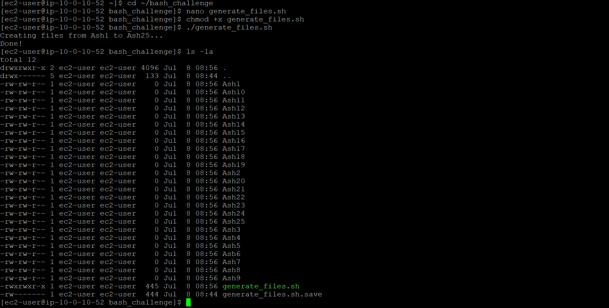
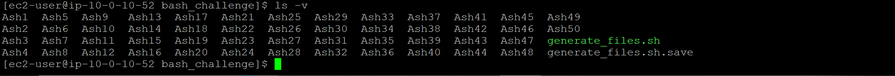

# ◈ Advanced Bash Scripting and Automation
**Course ID**: `251/253-[LX]-Lab`

## 🎯 Project Goal
The goal of this lab was to move away from manual administration and use automation to handle repetitive tasks. I focused on designing modular Bash scripts that can safely manage system backups, create batches of files dynamically, and run reliably without human intervention.

## ⚙️ How it Works
* **Dynamic Script Design:** I wrote scripts using for loops, variables, and arguments to handle repetitive tasks—like compression and file management—in just a single execution.
* **Environment Aware Execution:** Instead of hardcoding paths or names, I used system variables like `$USER` and `$(date +%F)` to ensure backups are automatically timestamped and organized cleanly.
* **Smart Sequential Logic:** I built condition-checking logic into the scripts so they could analyze the current file system state before running, preventing data from being accidentally overwritten.

## 📷 Lab Evidence

| Task | Delivery Check | Evidence |
| :--- | :--- | :--- |
| **1** | Script Execution & Initial Batch |  |
| **2** | Dynamic File Generation & Sequential Increment |  |

## 🛠️ Lessons Learned & Optimization
* **Solving the File-Overwrite Puzzle:** During the challenge task, my script needed to generate new batches of files without resetting the count or stepping on older data. To fix this, I used an incremental conditional check to dynamically find the highest existing number in the directory and increment the counter from there.
* **Quotes Matter in Bash:** I learned the hard way that missing quotes around variables can break a script instantly if a filename contains spaces. Ensuring proper variable expansion (`"$VARIABLE"`) is the difference between a production-ready script and one that crashes unexpectedly.
* **The ROI of Automation:** Replacing manual file-tracking and sequential routines with an automated script completely removes human error. It guarantees that steps are executed identically every single time, making it incredibly easy to search, audit, or scale data during operations.

## 📊 Technical Competence
* Advanced Bash Shell Scripting
* Shell Variable Manipulation
* Dynamic File Automation
* Conditional Flow Control Structures (`while` and `for` loops)
* Automation Workflow Design
