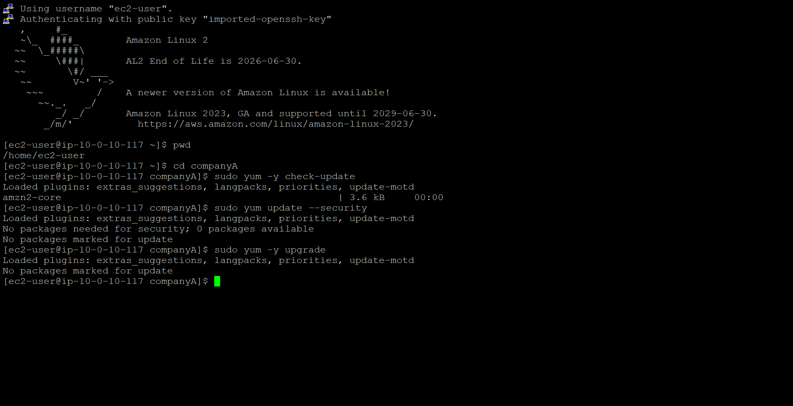
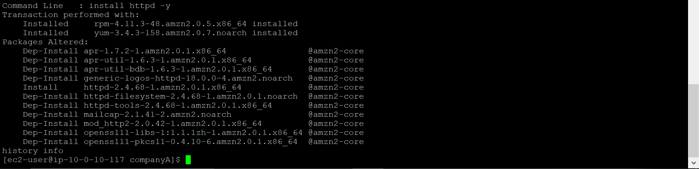

# ◈ Software Management
**Course ID**: `243-[LX]-Lab`

## 🎯 Project Goal
The goal of this lab was to master software lifecycle management on a Linux server and establish a secure, programmatic connection to cloud infrastructure. I practiced updating system packages, performing rollbacks to recover from broken installations, and configuring the AWS CLI to interact with AWS APIs.

## ⚙️ How it Works
Package Management: I used the yum package manager to query, install, and update system software, keeping the operating system secure and patched against known vulnerabilities.

System Rollbacks: I used the package manager's underlying transaction database to track exactly what changes had been made to the system and safely undo specific installations.

Cloud Authentication: I installed the AWS CLI and securely linked my local Linux instance to my AWS account by configuring my access keys and session tokens.

## 📷 Lab Evidence
| Task | Delivery Check | Evidence |
| :--- | :--- | :--- |
| **1** | System Update Status |  |
| **2** | Transaction History Audit |  |
| **3** | Successful CLI Verification |  |

## 🛠️ Lessons Learned & Optimization
Undoing a Bad Update: Installing software can sometimes break existing dependencies. I learned how to use yum history to view a timeline of every change made to the server. By running sudo yum history undo <transaction-id>, I safely rolled back a problematic installation and brought the system back to a stable state without a full rebuild.

Managing Temporary Cloud Credentials: When configuring the AWS CLI in a lab environment, things don't always work if you only provide the access key and secret key. I ran into API errors because I missed the temporary session token. Manually auditing my ~/aws/credentials file and making sure the aws_session_token parameter matched my environment variables fixed the connection immediately.

Ditching the Management Console: Once the AWS CLI was configured, I could query AWS resources instantly right from the terminal. Moving away from the browser-based AWS Management Console speeds up administration dramatically and lays the groundwork for scripting cloud infrastructure tasks.

## 📊 Technical Competence
Linux Package Management (yum), System Rollbacks (yum history), AWS CLI Installation & Configuration, IAM Credential Management, Programmatic API Interaction.
