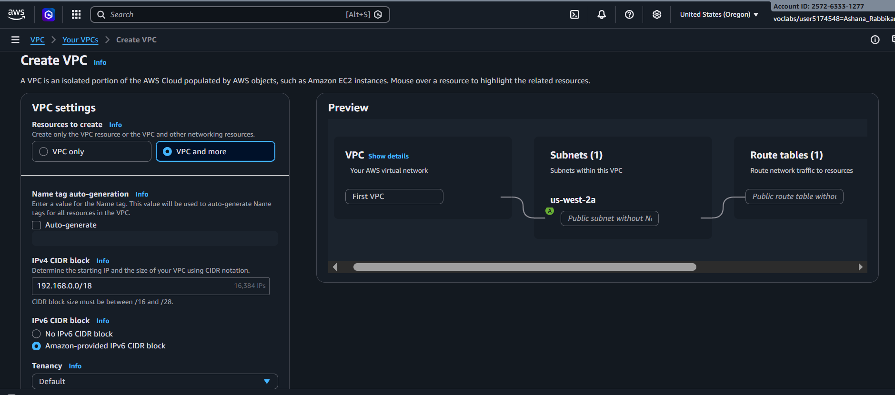
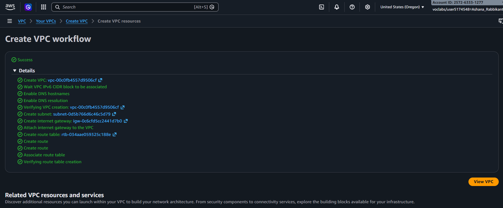
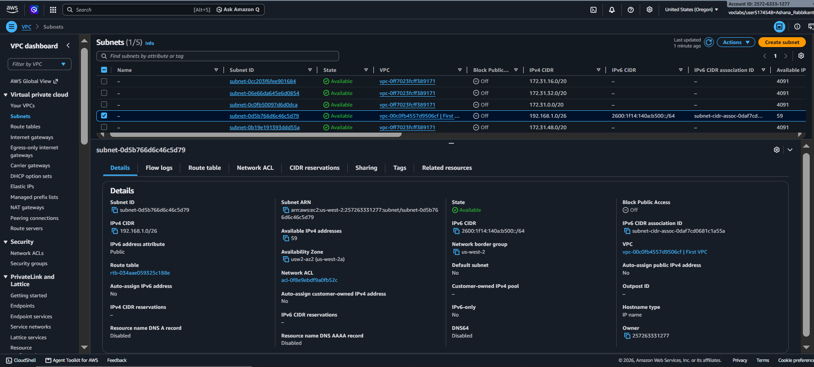

# ◈ AWS Networking - Subnetting & VPC Address Allocation
**Course ID**: `263-[NF]-Lab`

## 🎯 Project Goal
The goal of this lab was to act as an AWS Cloud Support Engineer resolving a networking request for a customer launching a new startup infrastructure. I analyzed custom network requirements, applied standard IPv4 CIDR subnetting techniques adhering to RFC 1918 specifications, and provisioned a custom Amazon VPC with a dedicated public subnet designed to support thousands of internal private IP addresses alongside scalable public-facing capacity.

## ⚙️ How it Works
* **Architectural Requirements Analysis**: The customer required a dedicated VPC capable of hosting ~15,000 private IP addresses along with a public subnet supporting at least 50 IP addresses within the `192.x.x.x` space.
* **RFC 1918 CIDR Calculation**: I selected the private range `192.168.0.0/18` for the main VPC—providing 16,384 total private IP addresses (exceeding the 15,000 requirement). For the public subnet, I allocated `192.168.1.0/26`—providing 64 total addresses (59 usable AWS IPs, satisfying the 50 IP requirement).
* **VPC & Subnet Provisioning**: Using the AWS VPC Service, I built the custom `First VPC` environment with an attached Internet Gateway and provisioned the isolated `Public subnet` within the primary Availability Zone.

## 📷 Lab Evidence
| Task | Description | Evidence |
| :--- | :--- | :--- |
| **1** | VPC & Subnet CIDR Calculation Parameters |  |
| **1** | Successful VPC Provisioning Confirmation |  |
| **1** | Public Subnet CIDR & VPC Association |  |

## 🛠️ Lessons Learned & Optimization
* **RFC 1918 Address Range Constraints**: When designing custom cloud networks, selecting the correct RFC 1918 range (`10.0.0.0/8`, `172.16.0.0/12`, or `192.168.0.0/16`) is critical. Since the customer specifically requested a `192.x.x.x` block, utilizing `192.168.0.0/16` ensured the network remained non-routable on the public internet while avoiding overlap with external web traffic.
* **AWS Subnet Reservation Rule**: AWS automatically reserves **5 IP addresses** in every subnet (the first 4 and the last 1) for internal networking purposes (Network ID, VPC Router, DNS, AWS reserved, and Broadcast). Calculating a `/26` netmask (64 total IPs) yielded 59 usable IPs, perfectly exceeding the customer's minimum target of 50 usable host addresses.
* **Subnet Hierarchy Rules**: A subnet's CIDR block must always be a logical subset of the parent VPC's CIDR block. Setting the VPC to `/18` (`192.168.0.0` - `192.168.63.255`) allowed the `/26` subnet (`192.168.1.0` - `192.168.1.63`) to fit cleanly within the parent address space without routing collisions.

## 📊 Technical Competence
Amazon VPC Provisioning, Subnet Mask Calculation, RFC 1918 Private IPv4 Standards, CIDR Block Allocation, AWS Reserved IP Accounting, Cloud Network Topology Design.
