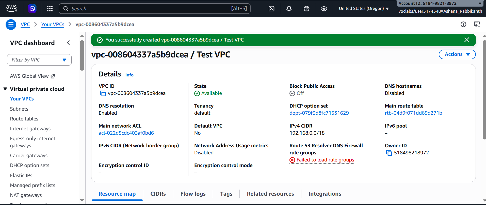
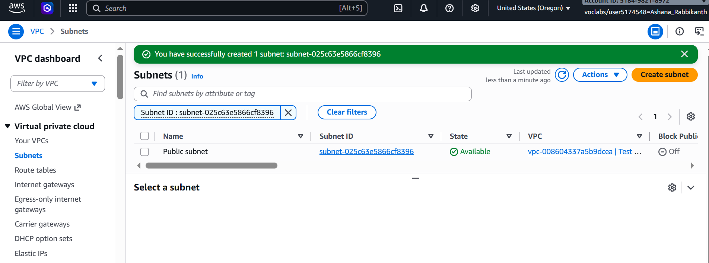
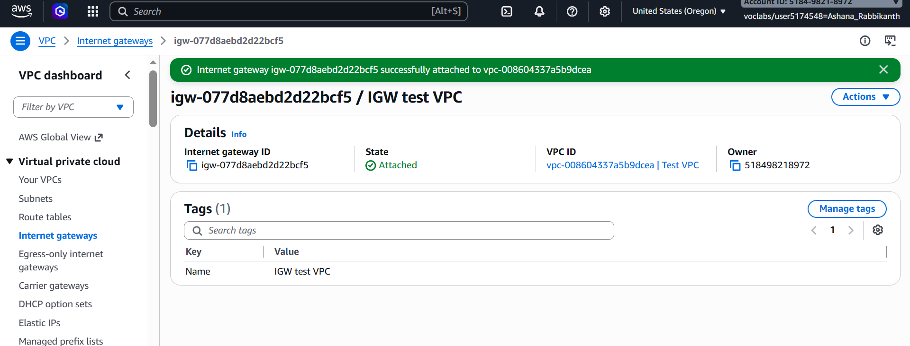
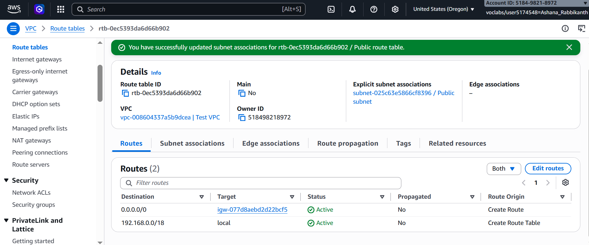
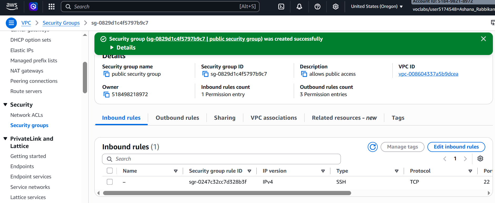
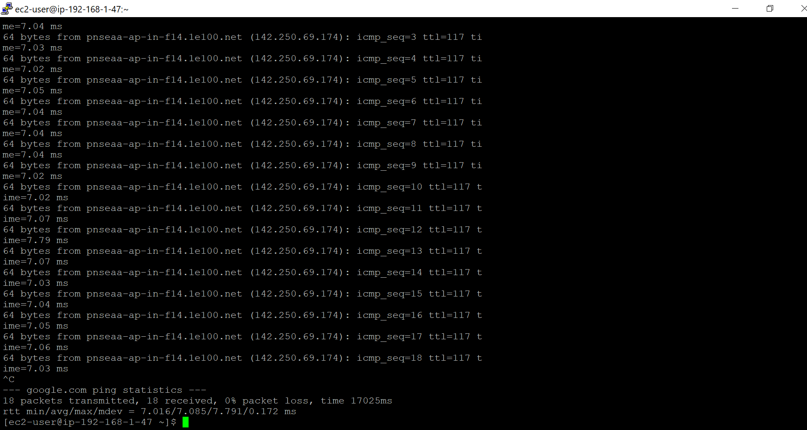

# ◈ VPC Networking & Connectivity
**Course ID**: `264-[NF]-Lab - Networking resources for a VPC`

## 🎯 Project Goal
Designing and deploying a custom Virtual Private Cloud (VPC) from scratch to establish isolated networking infrastructure, routing, security controls, and verified public internet access for compute resources.

## ⚙️ Technical Implementation
* **VPC & Subnetting:** Provisioned a custom VPC (`192.168.0.0/18`) named `Test VPC` along with a dedicated `Public subnet` (`192.168.1.0/26`).
* **Routing & Gateways:** Created and attached an Internet Gateway (`IGW test VPC`), then configured a custom `Public route table` with a default route (`0.0.0.0/0`) targeting the IGW to enable external internet access.
* **Security & Traffic Control:** Configured a stateless Network Access Control List (`Public Subnet NACL`) at the subnet level and stateful Security Groups (`public security group`) allowing inbound SSH (Port 22) access at the instance level.
* **Compute & Connectivity:** Launched a `t3.micro` EC2 instance (`Bastion Server`) within the public subnet and established an active SSH session via PuTTY.

## 📸 Lab Evidence
| Step | Architecture Component | Verification Artifact |
| :--- | :--- | :--- |
| **01** | VPC Provisioning |  |
| **02** | Subnet Allocation |  |
| **03** | Internet Gateway Attachment |  |
| **04** | Route Table Configuration |  |
| **05** | Security Group Rules |  |
| **06** | Outbound ICMP Ping Verification |  |

## 🛠️ Operational Intelligence (Troubleshooting)
* **Real-World Challenge:** Encountered initial connectivity confusion regarding multi-layered security controls and verifying outbound ICMP traffic through configured route tables and firewall rules.
* **Engineering Resolution:** Confirmed stateful security group behaviors and verified that Network ACLs explicitly allowed all traffic inbound/outbound on rule `100`; validated end-to-end network connectivity by executing an ICMP `ping google.com` test directly from the instance CLI, achieving a 0% packet loss rate.
* **"What If" Scenario:** In a production environment, I would avoid placing compute resources directly in public subnets unless acting as a Bastion host. Instead, I would place application instances in private subnets and route outbound traffic through a **NAT Gateway** to maintain security isolation while enabling internet access for updates.

## 📊 Technical Competence
* **Demonstrated Skills:** Custom VPC Architecture, Route Table Engineering, Internet Gateway Integration, Security Group & NACL Configuration, Remote SSH Administration, and Network Diagnostics.
