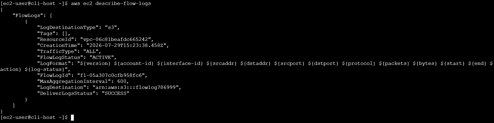
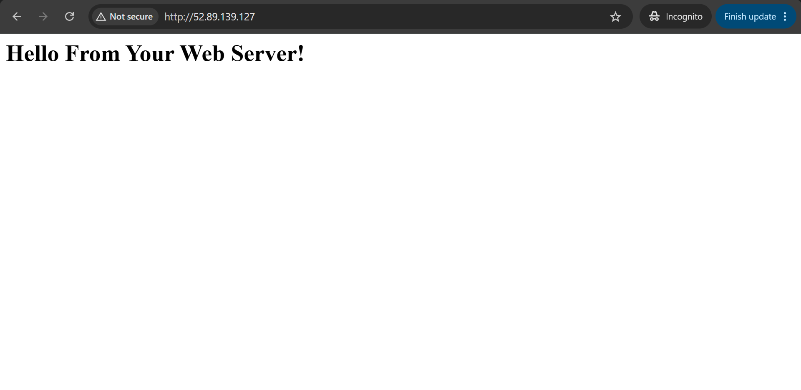
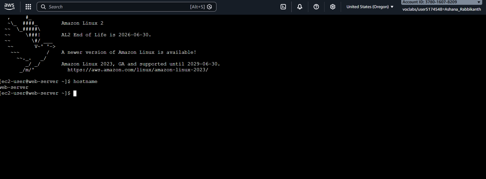
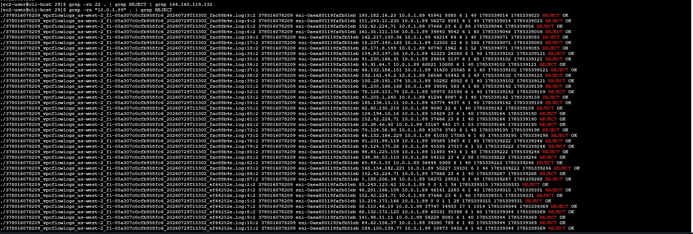
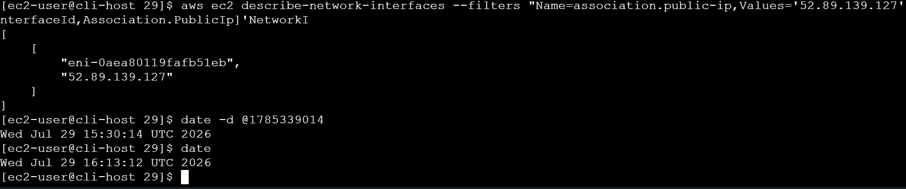

# ◈ Troubleshooting a VPC
**Course ID**: `181-[JAWS]-Activity`

## 🎯 Project Goal
Diagnosing and resolving real-world network connectivity issues across VPC boundaries using AWS CLI programmatic access, while setting up VPC Flow Logs to capture, analyze, and verify network traffic data.

## ⚙️ Technical Implementation
* **Log Aggregation:** Created a dedicated Amazon S3 bucket (`flowlog786999`) and configured an active VPC Flow Log on `VPC1` to capture all IP traffic for network interface analysis.
* **CLI-Driven Troubleshooting:** Utilized AWS CLI commands exclusively (`describe-instances`, `describe-security-groups`, `describe-route-tables`, `describe-network-acls`) via an isolated CLI Host instance to map out network rules and target configuration bottlenecks.
* **Network Remediation:** Configured missing Internet Gateway route table entries to allow external HTTP traffic and removed explicit drop rules from Network Access Control Lists (NACLs) to restore SSH connectivity.
* **Log Analysis & Forensic Verification:** Downloaded and extracted compressed VPC flow logs (`gunzip`), executed `grep` and `wc` command chains to isolate blocked traffic (`REJECT`), and converted Unix timestamps to human-readable UTC time to correlate network drops with specific access attempts.

## 🛠️ Operational Intelligence (Troubleshooting)
* **Real-World Challenge #1:** The web server was completely inaccessible over HTTP, despite the EC2 instance being in a healthy `running` state.
* **Engineering Resolution #1:** Analyzed the public subnet route table associated with `VPC1`, identified a missing default route (`0.0.0.0/0`) targeting the Internet Gateway, and created the required route to successfully restore web page access.
* **Real-World Challenge #2:** Web connectivity was restored, but EC2 Instance Connect (SSH on Port 22) continued to time out.
* **Engineering Resolution #2:** Evaluated security groups and subnet NACLs. Identified a restrictive DENY rule on port 22 within the subnet NACL and deleted the entry (`delete-network-acl-entry`), successfully establishing an SSH terminal connection to the `web-server`.
* **"What If" Scenario:** In a production enterprise environment, manually sifting through raw `.log` files using CLI utilities becomes inefficient at scale. I would ingest VPC Flow Logs into **Amazon Athena** using AWS Glue Data Catalog to run structured SQL queries directly against S3, or stream logs into **Amazon CloudWatch Logs Insights** for real-time traffic visualization and metric alarms.

## 📊 Technical Competence
* **Demonstrated Skills:** VPC Troubleshooting, VPC Flow Logs Creation & Parsing, Route Table Configuration, Network ACL Remediation, AWS CLI Programmatic Diagnosis, and Linux Log Analysis (`grep`, `gunzip`, `date` conversions).

---

## 📷 Proof of Work

### 1. Active VPC Flow Log Configuration

### 2. Successful HTTP Web Access

### 3. SSH Instance Connect Verification

### 4. Flow Log REJECT Traffic Analysis

### 5. ENI & Timestamp Conversion Verification

