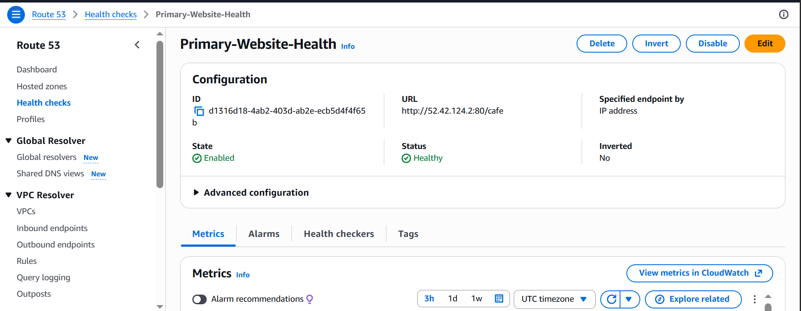
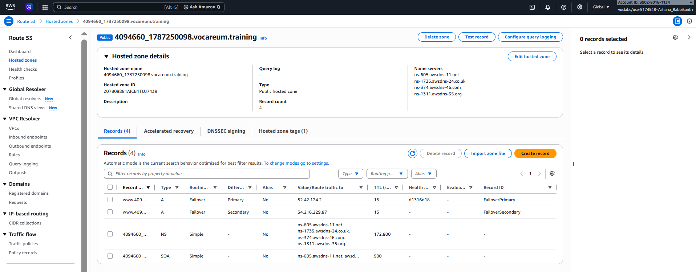
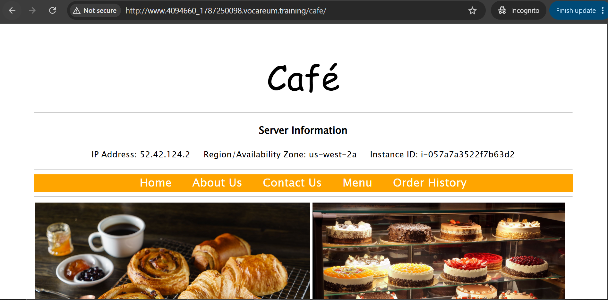
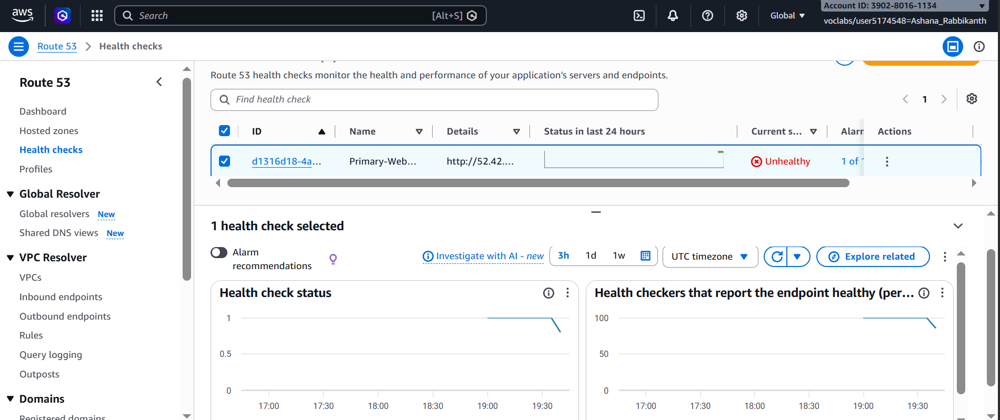
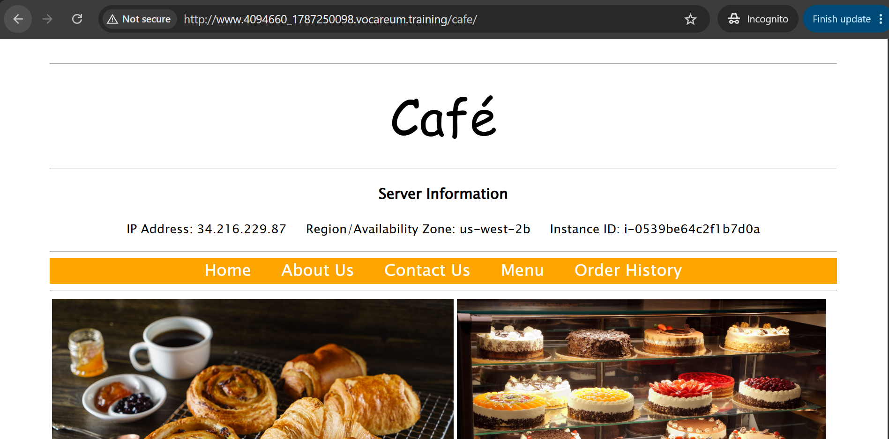
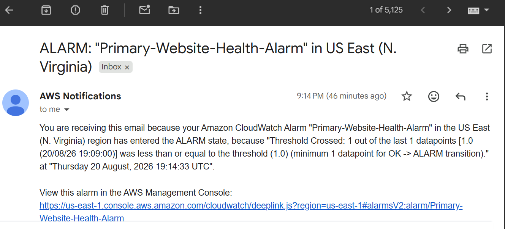

# Amazon Route 53 Failover Routing

**Course ID:** 176-[JAWS]-Activity

---

## 🎯 Project Goal
The goal of this project was to design and deploy a highly available, fault-tolerant web application infrastructure using Amazon Route 53. I configured active-passive failover routing across two distinct Availability Zones so that incoming user traffic automatically shifts away from an unhealthy primary EC2 web server to a secondary standby server without manual intervention or extended downtime.

---

## ⚡ How it Works
* **Active-Passive Redundancy:** I deployed two identical Apache/PHP LAMP stack web servers across separate Availability Zones (`us-west-2a` and `us-west-2b`). Traffic is normally routed directly to `CafeInstance1` (Primary), while `CafeInstance2` (Secondary) stands by to take over during an outage.
* **Continuous Endpoint Monitoring:** I established a Route 53 Health Check aimed directly at the primary application path (`/cafe`). Configured with a fast 10-second request interval and a low failure threshold of 2, Route 53 actively detects web server unresponsiveness within seconds.
* **Automated DNS Failover & Alerting:** Using low-TTL (15 seconds) `A` DNS records in my custom hosted zone, Route 53 dynamically updates DNS resolution based on health check results. If the primary server drops, Route 53 immediately shifts DNS responses to the secondary instance and triggers a CloudWatch Alarm to send an email alert via Amazon SNS.

---

### 📷 Lab Evidence

| Task | Delivery Check | Evidence |
| :---: | :--- | :--- |
| **1** | Health Check & Monitoring Setup |  |
| **2** | DNS Failover Record Configuration |  |
| **3** | Primary Route 53 DNS Resolution |  |
| **4** | Health Check Failure Detection |  |
| **5** | Secondary Failover Verification |  |
| **6** | CloudWatch & SNS Email Notification |  |

---

## 🛠️ Lessons Learned & Optimization
* **Managing DNS TTL and Caching Lag:** During testing, I observed that browsers and local resolvers can cache DNS records longer than expected if the TTL is set too high. Keeping the TTL aggressively low (15 seconds) during the lab ensured that traffic transitioned to `CafeInstance2` almost immediately after Route 53 flipped the health check status.
* **Precision Health Checking Paths:** Setting a health check to monitor just the root IP (`/`) can give a false sense of security if the web server is running but the actual web application script (`/cafe`) is broken or returning 500 errors. Pointing the health check specifically to the application path ensured Route 53 validates real end-user application availability rather than simple network reachability.
* **Designing for High Reliability:** In a production environment, active-passive EC2 failover can lead to stale data if backend databases aren't synchronized. To optimize this architecture, I would decouple the database tier by introducing a multi-AZ Amazon RDS instance with automatic replication. Additionally, placing an Application Load Balancer (ALB) or Amazon CloudFront distribution in front of the instances would allow for smoother blue-green deployments and even faster global failover times.

---

## 🚀 Technical Competence
* Amazon Route 53 (DNS Management & Hosted Zones)
* Failover Routing Policies (Primary & Secondary)
* Route 53 Endpoint Health Checks
* Amazon CloudWatch Alarms & Metrics
* Amazon SNS (Simple Notification Service)
* Multi-AZ EC2 High Availability Architecture
