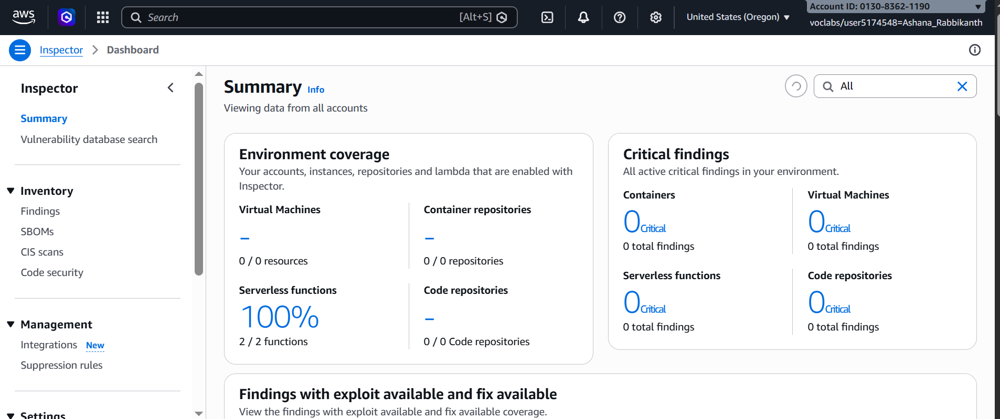
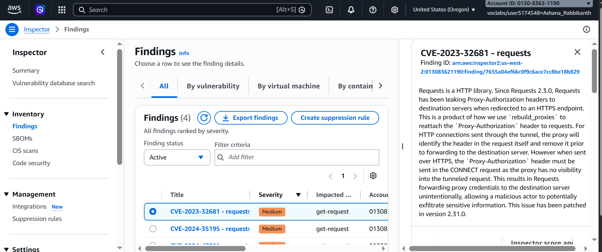
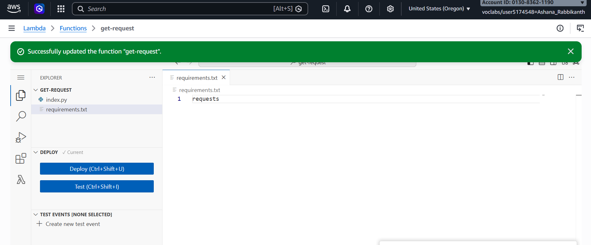
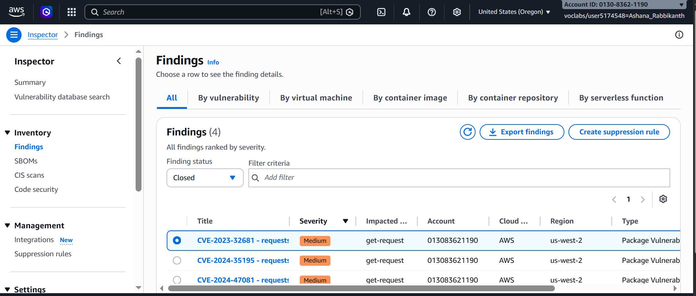

# ◈ Network Hardening: Vulnerability Assessment & Remediation
**Course ID**: `276-[SF]-Lab`

## 🎯 Project Objective
Automating security vulnerability scanning and continuous compliance monitoring across serverless execution environments to identify software dependencies risks and enforce remediation guardrails.

## ⚙️ Technical Implementation
* **Vulnerability Scanning:** Enabled Amazon Inspector across the AWS account to establish 100% environment coverage for deployed serverless infrastructure and automated package analysis.
* **Risk Identification:** Analyzed active findings reported by Amazon Inspector, isolating a medium-severity vulnerability (`CVE-2023-32681`) linked to an outdated `requests` package version within the `get-request` AWS Lambda function.
* **Code Remediation:** Modified the function's `requirements.txt` file to remove strict version pinning (`requests==2.20.0` to `requests`), triggering an automated redeployment to fetch the latest secure package release.

## 🛠️ Operational Intelligence (Troubleshooting)
* **Real-World Challenge:** Identified an active package vulnerability (`CVE-2023-32681`) that exposed HTTP headers during proxy redirects due to hardcoded, legacy dependencies in the function code.
* **Engineering Resolution:** Updated the package manifest to allow dynamic retrieval of patched binaries, redeployed the AWS Lambda function, and confirmed that Amazon Inspector re-scanned the resource and automatically transitioned the finding status from **Active** to **Closed**.
* **"What If" Scenario:** In a production pipeline, I would integrate **AWS CodePipeline with Amazon Inspector / Snyk SAST scanning** and enforce **DevSecOps pre-commit hooks**, preventing vulnerable third-party dependencies from reaching production environments during CI/CD builds.

## 📊 Technical Competence
* **Demonstrated Skills:** Amazon Inspector, Vulnerability Management, AWS Lambda Configuration, Dependency Remediation, DevSecOps Principles, and Security Posture Assessment.

## 📸 Lab Evidence

### 1. Amazon Inspector Activation & Coverage

### 2. Vulnerability Finding Analysis (CVE-2023-32681)

### 3. Lambda Code Remediation & Deployment

### 4. Verified Closed Finding Status

