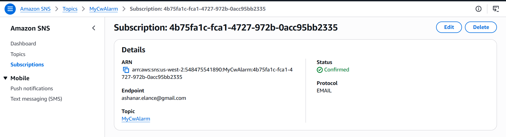
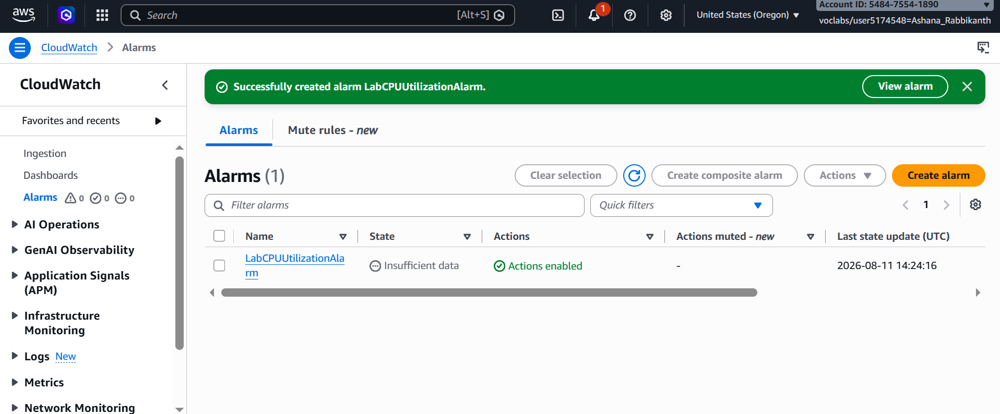
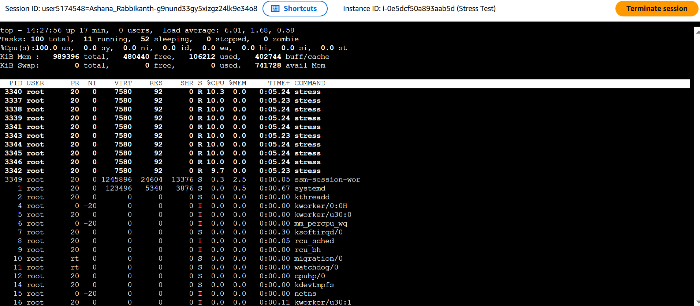
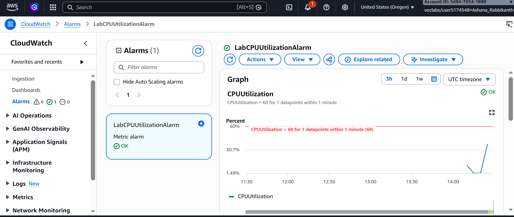
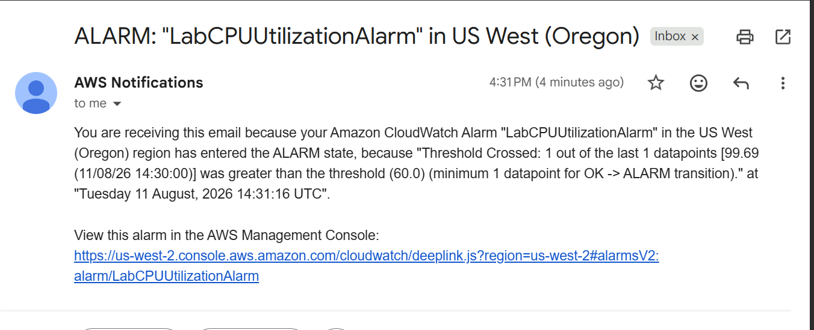
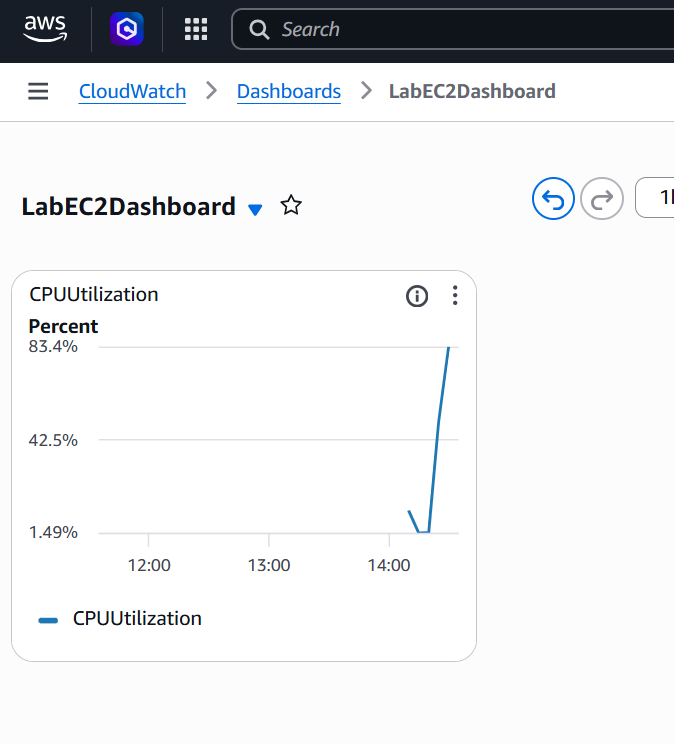

# AWS CloudWatch EC2 Monitoring & Alarm Automation

**Course ID:** 281-[SF]-Lab

---

## 🎯 Project Goal
The goal of this project was to establish real-time system monitoring and automated incident response for cloud infrastructure. I practiced setting up infrastructure metrics in Amazon CloudWatch, configuring automated multi-channel alerts via Amazon SNS, simulating security/performance incidents through CPU load testing, and visualizing metrics on a custom operational dashboard.

---

## ⚙️ How it Works
* **Decoupled Alerting Pipeline:** I created an Amazon SNS topic (`MyCwAlarm`) with an email subscription to decouple the event monitoring from notification delivery, allowing instant automated alerts whenever system metrics breach predefined thresholds.
* **Proactive Threshold Monitoring:** I configured a metric-based CloudWatch Alarm (`LabCPUUtilizationAlarm`) to continuously evaluate 1-minute average CPU utilization on an EC2 instance (`Stress Test`) and trigger an `In Alarm` state when usage exceeds 60%.
* **Simulated Malicious Spikes:** I accessed the target server and executed a multi-core CPU stress command (`sudo stress --cpu 10 -v --timeout 400s`) to force CPU load to 100%, simulating an operational issue or malware infection to test the alarm pipeline.
* **Unified Observability:** I constructed a centralized CloudWatch dashboard (`LabEC2Dashboard`) featuring line-graph widgets to give ops teams a single pane of glass for real-time performance tracking.

---

### 📸 Lab Evidence

| Task | Delivery Check | Evidence |
| :---: | :--- | :--- |
| **1** | SNS Topic & Email Subscription |  |
| **2** | CloudWatch Metric Alarm Setup |  |
| **3** | Stress Testing & Incident Detection |          |
| **4** | Custom Operational Dashboard |  |

---

## 💡 Lessons Learned & Optimization
* **Managing Metric Granularity & Evaluation Periods:** Standard EC2 monitoring reports metrics to CloudWatch at 5-minute intervals. Configuring a 1-minute period for alarm evaluation allowed the system to catch the CPU spike quickly, but in production, I would enable Detailed Monitoring (1-minute reporting intervals) on critical EC2 instances to prevent delay in metric delivery.
* **Distinguishing Static vs. Anomaly Thresholds:** A static 60% CPU threshold works well for high-load simulation, but batch processing workloads might naturally spike without being an incident. Utilizing CloudWatch Anomaly Detection to dynamically adjust thresholds based on historical baseline trends would reduce false positives.
* **Automating Incident Remediation:** Receiving an SNS email alert is great for human intervention, but auto-remediation is faster. In a production setup, I would attach an EC2 Auto Scaling action or trigger an AWS Lambda function directly from the CloudWatch Alarm to automatically reboot, isolate, or scale out impacted instances when severe CPU spiking occurs.

---

## 🛠️ Technical Competence
* Infrastructure Monitoring & Observability (Amazon CloudWatch)
* Event Notification Orchestration (Amazon SNS)
* Metric Alarms & Threshold Configuration
* Operational Dashboard Engineering
* Linux Systems Performance Testing (`stress`, `top`)
* Incident Response & Detection Simulation
