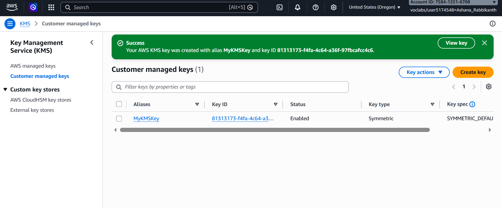
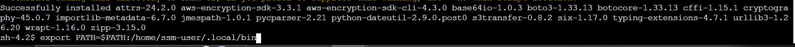
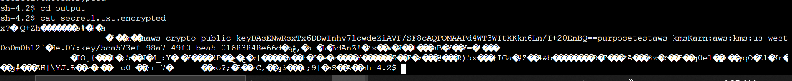
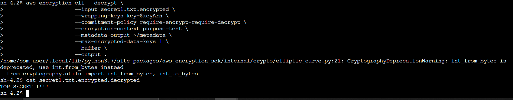

# ◈ Data Protection Using Encryption
**Course ID**: `278-[SF]-Lab`

## 🎯 Project Goal
Implementing server-side data confidentiality and cryptographic lifecycle management on EC2 workloads using AWS KMS key policies and the AWS Encryption CLI.

## ⚙️ Technical Implementation
* **Key Management:** Provisioned a symmetric AWS KMS customer managed key (`MyKMSKey`) with restricted key administrative and usage permissions assigned to designated IAM identities (`voclabs`).
* **Environment Provisioning:** Connected to the target EC2 File Server instance via Systems Manager Session Manager, updated regional AWS CLI credentials, and configured local execution paths for CLI tooling.
* **Cryptographic Operations:** Applied the AWS Encryption CLI to convert plaintext files into symmetric ciphertext using explicit encryption contexts (`purpose=test`) and commitment policies (`require-encrypt-require-decrypt`).
* **Decryption & Verification:** Executed reverse decryption pipelines using identical key wrapping specifications, validating data restoration back to original plaintext.

## 📸 Lab Evidence
* **KMS Key Creation:**  
  
* **AWS CLI Environment Configuration:**  
  
* **Encrypted Ciphertext Inspection:**  
  
* **Decrypted Plaintext Verification:**  
  

## 🛠️ Operational Intelligence (Troubleshooting)
* **Real-World Challenge:** Executing `aws-encryption-cli` failed with a `ModuleNotFoundError: No module named 'importlib.metadata'` trace due to Python 3.7 runtime incompatibilities with v4.x of the SDK CLI package.
* **Engineering Resolution:** Identified version mismatch between Python 3.7 and modern package entry points; uninstalled version 4.x and force-installed `aws-encryption-sdk-cli<4.0.0` to restore native CLI functionality.
* **"What If" Scenario:** In a production pipeline, I would enforce key rotation policies in KMS, manage secrets via AWS Secrets Manager or Parameter Store instead of local file storage, and automate file encryption/decryption using AWS Lambda triggers on S3 uploads.

## 📊 Technical Competence
* **Demonstrated Skills:** AWS KMS Key Management, Envelope Encryption, CLI Tooling Configuration, Cryptographic Context Enforcement, and Environment Troubleshooting.
