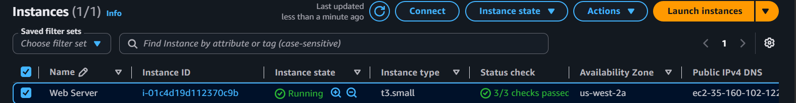
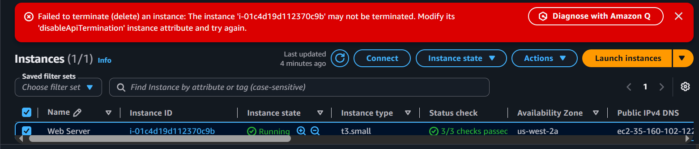

# ◈ EC2 Foundations and Provisioning
**Course ID**: `11-[CF]-Lab`

## 🎯 Project Goal
The goal of this lab was to get hands-on experience managing the lifecycle of an Amazon EC2 instance. I practiced launching a virtual server, automating software installation on boot, adjusting firewall rules, and modifying both compute and storage capacity on the fly.

## ⚙️ How it Works
Automated Provisioning: I launched an EC2 instance running Amazon Linux 2023 and passed a custom User Data bash script during creation to completely automate the installation and startup of an Apache web server.

Network Access Control: I managed the instance’s virtual firewall via Security Groups, troubleshooting web access by strictly controlling inbound traffic permissions.

Instance Scaling & Governance: I manually performed vertical scaling to adapt to shifting workloads—upgrading the instance type and expanding the root Elastic Block Store (EBS) volume. I also applied safeguards to protect the infrastructure from accidental destruction.

## 📷 Lab Evidence
| Task | Description | Evidence |
| :--- | :--- | :--- |
| **1** | Instance Launch & Status |  |
| **4** | Vertical Scaling (Compute) |  |
| **4** | Vertical Scaling (Storage) |  |
| **5** | Resource Governance Test |  |

## 🛠️ Lessons Learned & Optimization
The Connection Refused Gotcha: Immediately after launching, my browser requests to the web server timed out with a connection error. Instead of messing with the server itself, I verified that the underlying OS was fine and realized the issue was at the network layer: the instance's Security Group was missing a rule for HTTP traffic (Port 80). Adding that rule fixed the issue instantly, reinforcing the value of troubleshooting from the outside in.

Resizing Without Downtime: I learned that AWS allows you to modify an EBS root volume's size dynamically while the instance is still running. Upgrading the volume from 8 GiB to 10 GiB showed me how easy it is to scale storage resources without tearing down the application or causing user downtime.

Preventing Costly Mistakes: By enabling Termination Protection, I added an essential layer of operational safety. Trying to delete the instance threw an explicit warning, which is an industry best practice to prevent accidental command-line drops or dashboard misclicks in production environments.

## 📊 Technical Competence
EC2 Instance Lifecycle Management, Security Group Configuration, Bootstrap Scripting (User Data), EBS Volume Modification, Vertical Scaling Patterns, Cloud Resource Governance.
