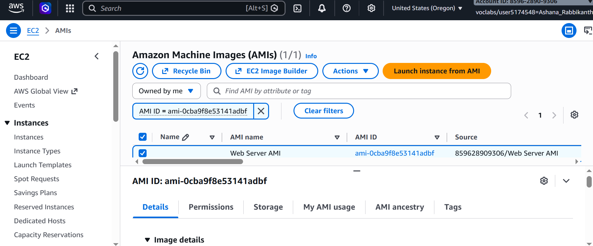
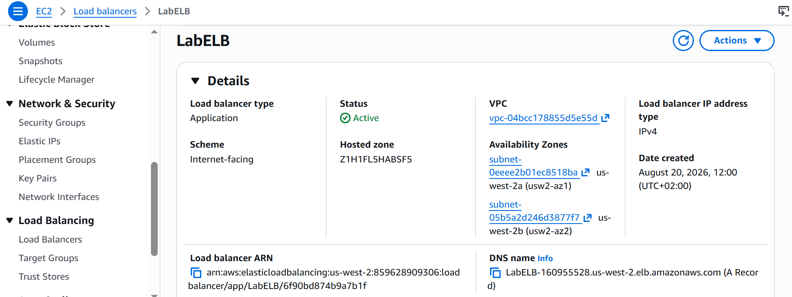
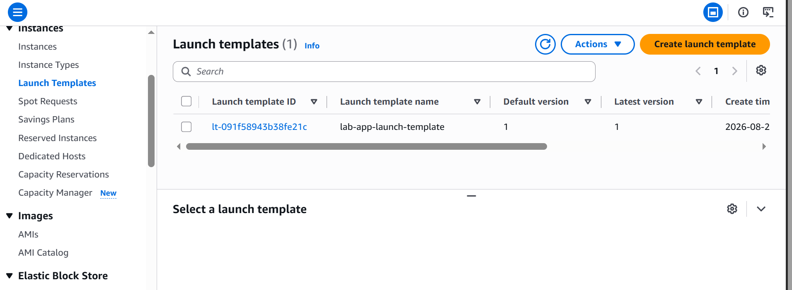
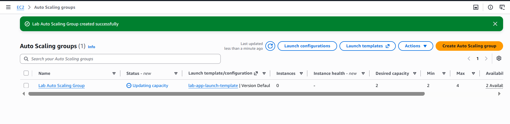
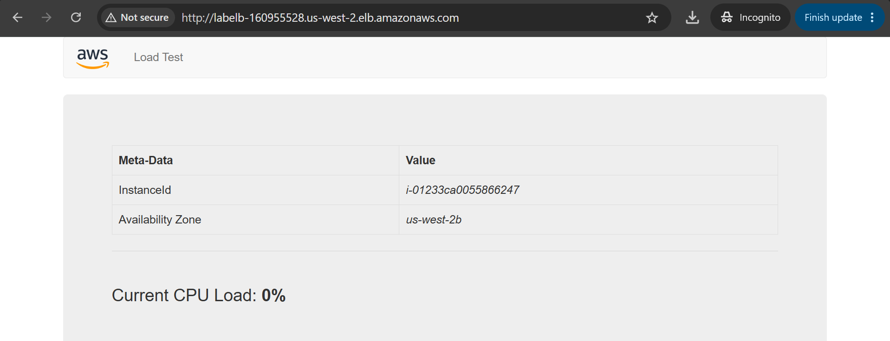
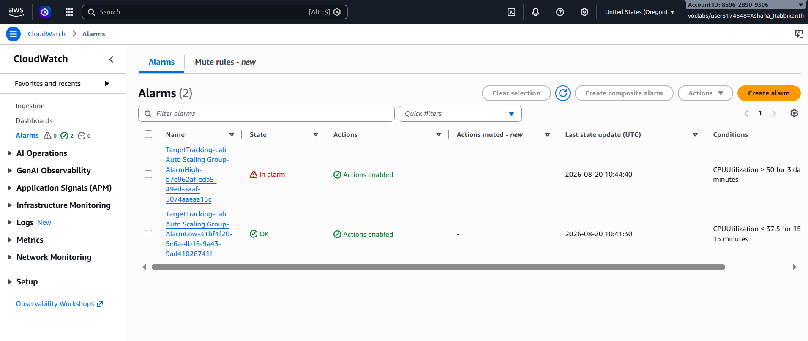
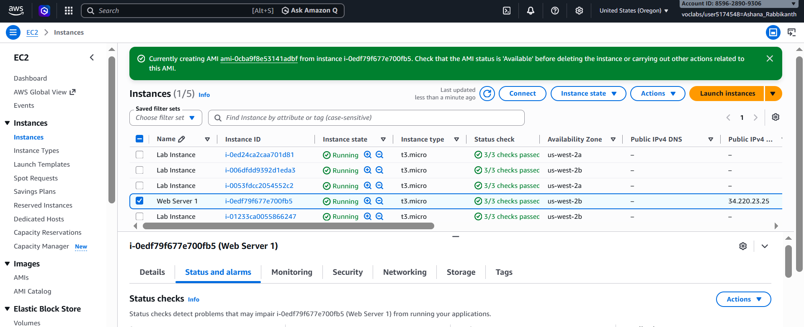
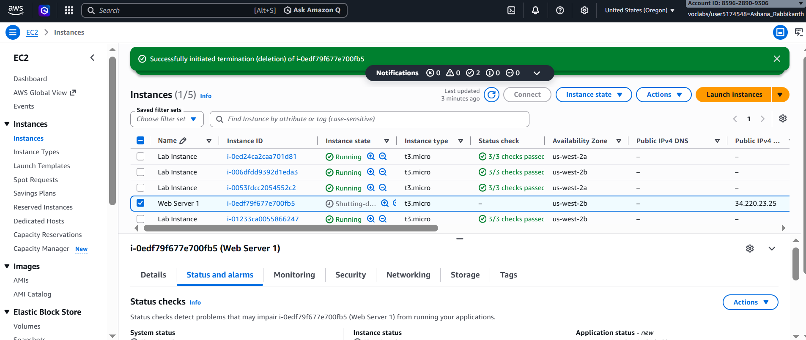

# Scale and Load Balance Your Architecture

**Course ID:** 174-[JAWS]-Lab

---

## 🎯 Project Goal
The goal of this project was to transition from a single, static web server setup to a fault-tolerant, highly available, and automatically scaled cloud infrastructure. I focused on packaging application environments into reusable Amazon Machine Images (AMIs), configuring an Elastic Load Balancer (ELB) to route incoming traffic, and leveraging EC2 Auto Scaling groups alongside CloudWatch alarms to dynamically adjust computing capacity based on real-time traffic demand.

---

## ⚙️ How it Works
* **Stateless Image Provisioning:** I created a custom AMI from an active EC2 instance to store the operating system, server configurations, and web application files, ensuring that any new instances launched were identical copies.
* **Traffic Distribution via Application Load Balancer:** I deployed an Application Load Balancer across two public subnets in different Availability Zones. Incoming web traffic hits the load balancer's DNS endpoint and gets evenly distributed across backend instances registered within a target group.
* **Automated & Secure Fleet Scaling:** I built a launch template attached to an Auto Scaling group that provisions EC2 instances across private subnets. The group maintains a target tracking scaling policy set to keep average CPU utilization at 50%, adding or terminating instances automatically based on system load.

---

### 📷 Lab Evidence

| Task | Delivery Check | Evidence |
| :---: | :--- | :--- |
| **1** | Custom Image Creation |  |
| **2** | Load Balancer Provisioning |  |
| **3** | Auto Scaling Launch Template |  |
| **4** | Auto Scaling Group Setup |  |
| **5** | Target Health & Traffic Routing |  |
| **6** | CloudWatch Alarm & Auto Scaling Under Load |      |
| **7** | Infrastructure Maintenance & Cleanup |  |

---

## 💡 Lessons Learned & Optimization
* **Designing Across Availability Zones:** Placing the load balancer in public subnets across multiple AZs while launching application instances inside private subnets provided a strong security layer and eliminated single points of failure. Even if an entire Availability Zone experiences an outage, the architecture remains operational.
* **Fine-Tuning Health Checks:** Initially waiting for target instances to transition to a healthy state showed the importance of configuring proper load balancer health checks. The ELB won't pass public traffic to an EC2 instance until it passes HTTP health evaluations, preventing user-facing 502/504 errors during instance spin-up.
* **Managing Dynamic Scale-In & Scale-Out:** Testing the CPU stress generator demonstrated how target tracking scaling policies work in tandem with CloudWatch alarms (`AlarmHigh` and `AlarmLow`). When high CPU threshold conditions were sustained, the Auto Scaling group smoothly increased capacity from 2 to 4 instances to absorb the stress, proving the efficiency of auto-scaling over fixed manual provisioning.

---

## 🛠️ Technical Competence
* Amazon EC2 AMI Creation
* Elastic Load Balancing (Application Load Balancer)
* EC2 Auto Scaling & Launch Templates
* Target Tracking Scaling Policies
* Amazon CloudWatch Performance Monitoring & Alarms
* Multi-AZ VPC Subnet Design & Traffic Isolation
