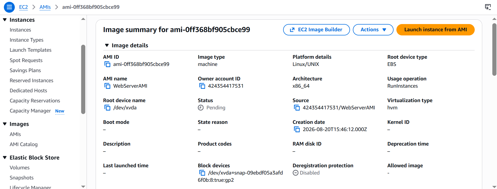
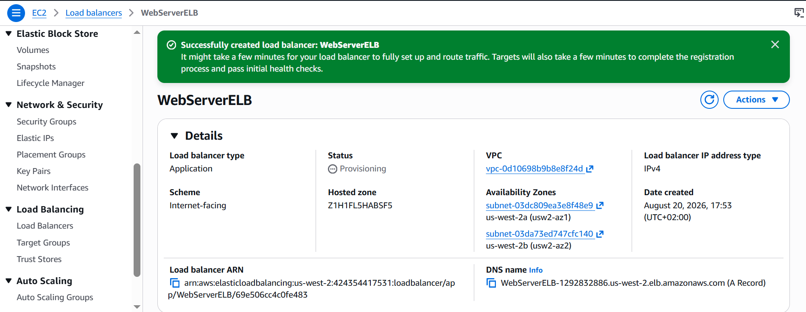
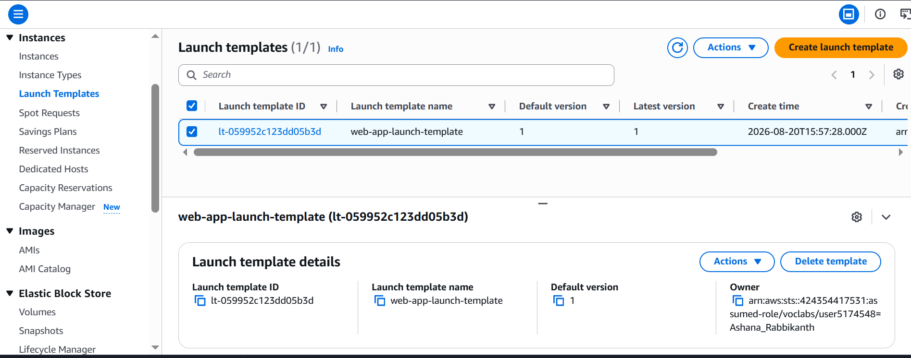
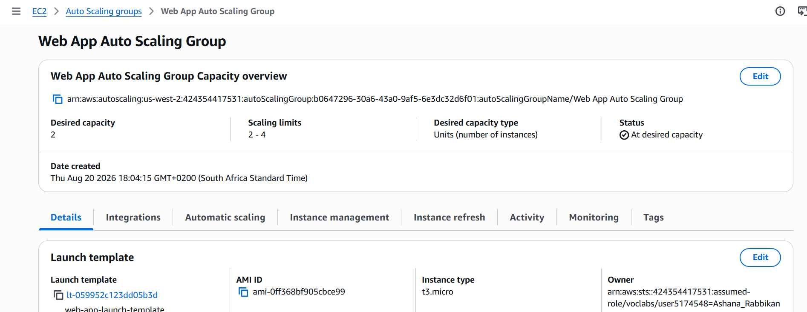
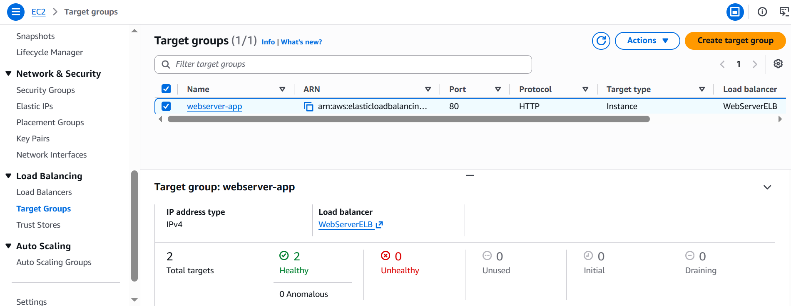
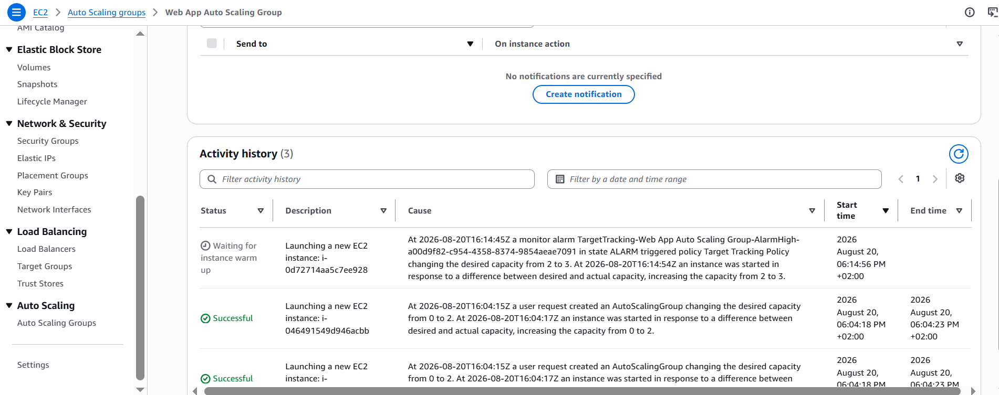

# AWS Auto Scaling & Elastic Load Balancing (Linux)

**Course ID:** 175-[JAWS]-Lab

---

## 🎯 Project Goal
The goal of this lab was to transition from a single, static web server setup to a highly available, fault-tolerant, and auto-scaling infrastructure on AWS. Using the AWS CLI and the AWS Management Console, I built a custom Amazon Machine Image (AMI), deployed an Application Load Balancer (ALB) across multiple Availability Zones, and configured an Auto Scaling Group (ASG) to dynamically scale EC2 capacity in response to real-time CPU stress.

---

## ⚙️ How it Works
* **Custom Image Creation:** I connected to a Command Host instance via EC2 Instance Connect and used the AWS CLI to launch a WebServer EC2 instance pre-loaded with a stress-testing application. After verifying the web application, I captured a custom AMI (`WebServerAMI`) to serve as the blueprint for future scalable instances.
* **Elastic Load Balancing (ALB):** I configured an internet-facing Application Load Balancer (`WebServerELB`) mapped across public subnets in two Availability Zones. Traffic was directed to a target group (`webserver-app`) configured with path-based HTTP health checks (`/index.php`).
* **Dynamic Auto Scaling:** Using a Launch Template (`web-app-launch-template`), I established an Auto Scaling Group (`Web App Auto Scaling Group`) spanning private subnets across both Availability Zones. I defined scaling limits (Desired: 2, Min: 2, Max: 4) and configured a Target Tracking Scaling Policy targeting 50% average CPU utilization.
* **Automated Self-Healing & Scale-Out:** The Auto Scaling Group automatically monitors target health. When synthetic CPU load was generated using the application's stress utility, CloudWatch alarms automatically triggered the ASG policy to spin up additional EC2 capacity seamlessly.

---

### 📸 Lab Evidence

| Task | Delivery Check | Evidence |
| :---: | :--- | :--- |
| **1** | Custom AMI Creation via CLI |  |
| **2** | Application Load Balancer Configuration |  |
| **3** | Auto Scaling Launch Template Setup |  |
| **4** | Auto Scaling Group & Scaling Policies |  |
| **5** | Target Group Health Verification |  |
| **6** | CloudWatch Metric & Scale-Out Execution |  |

---

## 💡 Lessons Learned & Optimization
* **Handling Health Check Delays:** During initial load balancer setup, target instances temporarily display an `Initial` status before transitioning to `Healthy`. Ensuring that the health check path (`/index.php`) matches the actual web application root prevents the load balancer from marking healthy instances as degraded.
* **Target Tracking vs. Simple Scaling:** Setting up a target tracking policy based on 50% CPU utilization simplified scaling management. Instead of manually configuring separate step alarms for scale-in and scale-out, AWS handles the mathematical adjustments automatically to keep the average load stable.
* **Isolating Application Tier in Private Subnets:** Placing Auto Scaling instances inside private subnets while routing external public web traffic strictly through the Application Load Balancer aligns with cloud security best practices, protecting web servers from direct internet exposure.

---

## 🛠️ Technical Competence
* AWS CLI Instance & Image Management
* Custom Amazon Machine Image (AMI) Creation
* Application Load Balancer (ALB) & Multi-AZ Routing
* Target Group Health Checks & Load Distribution
* EC2 Launch Templates & Security Group Rules
* Auto Scaling Groups & Target Tracking Policies
* Amazon CloudWatch Alarms & Dynamic Scale-Out
