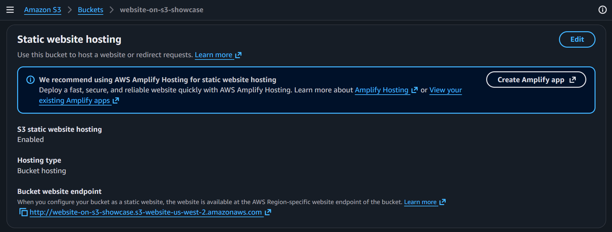
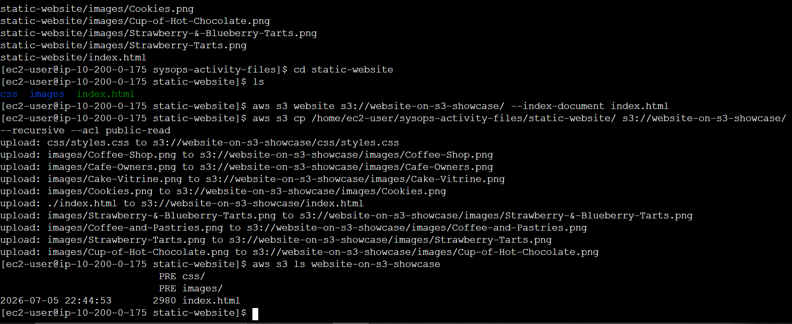

# ◈ Static S3 Web Hosting
**Course ID**: `170-[JAWS]-Activity`

## 🎯 Project Goal
The goal of this project was to set up a highly available, low-cost static website using serverless architecture on Amazon S3, and to build an automated deployment script to make updating the site quick and easy.

## ⚙️ How it works
* **S3 Hosting & Access:** I enabled static website hosting on the bucket, configured the index document, and opened up public access by adjusting the Block Public Access (BPA) settings and setting up ACLs.
* **IAM Permissions:** To manage the bucket securely via the command line, I created a dedicated IAM user (`awsS3user`) and attached the `AmazonS3FullAccess` policy to it.
* **Automation Script:** I wrote a custom bash script (`update-website.sh`) using the AWS CLI to push local web files directly up to S3.
## 📷 Lab Evidence

| Task | Delivery Check | Evidence |
| :--- | :--- | :--- |
| 1 | Bucket Creation & Website Enablement |  |
| 2 | CLI-based Object Upload & IAM Audit |  |
| 3 | Browser-Based Connectivity Test |  |

## 🛠️ Lessons Learned & Optimization
* **The 403 Forbidden Hurdle:** When I first tried to view the site, I hit a 403 "Forbidden" error. I realized that the account-level Block Public Access settings were overriding my bucket settings. Disabling that block and enabling ACLs fixed the issue immediately.
* **Making Updates Efficient:** Instead of using `aws s3 cp` (which re-uploads every single file every time), I switched the script to use `aws s3 sync`. Now it runs an incremental update—checking file checksums and only uploading files that actually changed, saving time and bandwidth.
* **Next Steps for Production:** If I were taking this to a production environment, I’d throw a **CloudFront** distribution in front of the bucket. That way, I could keep the S3 bucket entirely private using Origin Access Control (OAC), add HTTPS encryption, and take advantage of edge caching for faster loading speeds globally.

## 📊 Technical Competence
AWS S3 Static Hosting, AWS CLI, Bash Shell Scripting, IAM Policies, Bucket Security & ACLs, Incremental Deployment Patterns (`s3 sync`).
