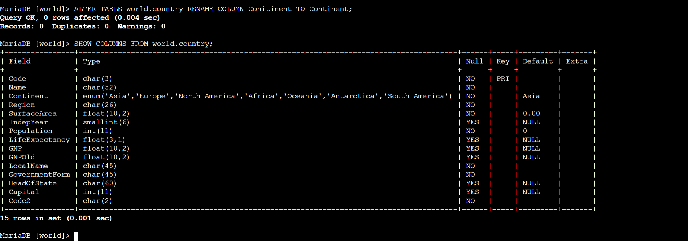
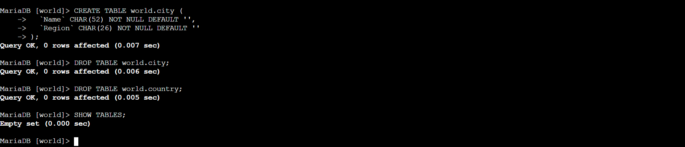

# Foundational Database & Table Lifecycle Operations

**Module Reference:** AWS Database Operations Lab
**Environment Architecture:** Linux CLI Engine Interface
**Course ID**: `268-[DF]-Lab`

---

## 🎯 Lab Objectives
In this exercise, I acted as a data infrastructure technician to directly interact with a database engine backend hosted on an Amazon EC2 Command Host instance. The goal was to build baseline database architecture containers, specify data constraints using structural layout definitions, modify data fields under production conditions, and practice decommissioning cleanup workflows using strict Data Definition Language (DDL) controls.

---

## ⚙️ Engineering Concepts
* **Direct SQL CLI Tunneling:** I utilized an interactive shell instance using secure AWS Session Manager configurations to gain server terminal terminal capabilities without exposing insecure login endpoints. 
* **Dynamic Structural Adjustments:** Rather than destroying data structures due to localized naming mistakes, I adjusted active layouts natively using administrative migration commands (`ALTER TABLE`), mitigating down-time risks.
* **Destructive Command Lifecycles:** I verified that structural deletions (`DROP`) completely remove targeted components from database engines, confirming that storage resources drop instantly upon target termination.

---

## 📸 Technical Artifacts

| Verification Stage | Process Performed | Execution Results |
| :---: | :--- | :--- |
| **01** | Production Schema Alteration |  |
| **02** | Structural Component Evacuation |  |

---

## 🧠 Key Takeaways
* **Catching Design Inconsistencies:** Spotting the structural error `Conitinent` allowed me to evaluate production data maintenance strategies. Applying updates live saves computing time and prevents structural issues with frontend connections.
* **The Finality of DDL Syntax Execution:** Seeing `Empty set` return from an automated engine system immediately following database removals emphasizes the absolute finality of raw management commands. In real production spaces, robust automated point-in-time recovery configurations or snapshot tracking routines must run beforehand to counter unauthorized data drops.
* **Managed Alternatives:** While practicing direct server management builds critical infrastructure fundamentals, production environments generally leverage fully managed engines like Amazon RDS to handle underlying system patching, backups, and operational availability configurations automatically.

---

## 💼 Core Skills Demonstrated
* Relational Architecture Modeling
* Data Definition Language (DDL) Queries
* Schema Lifecycle Tracking & Testing
* System Administrative Interface Execution
