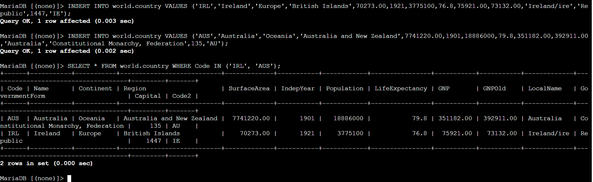
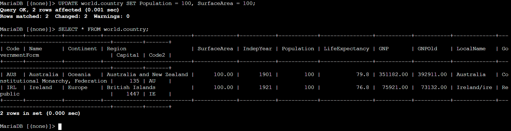
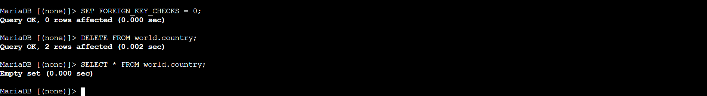
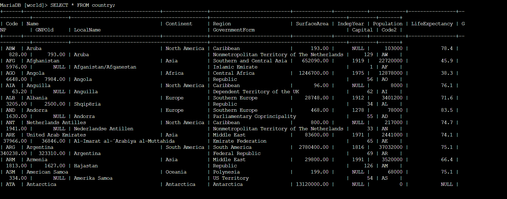

# ◈ Data Interaction and Lifecycle Management
**Course ID**: `269/270/271-[DF]-Lab`

## 🎯 Project Overview
In this lab workspace, I took on the responsibilities of a junior database administrator to manually test, manipulate, and validate data persistence paths inside a relational database system context. I focused heavily on executing direct Data Manipulation Language (DML) transactions (`INSERT`, `UPDATE`, `DELETE`) and executing an automated restoration script payload using system-level I/O input pipes.

## ⚙️ Core Technical Capabilities Demonstrated

### 1. Manual Record Ingestion & Row Layout Targeting
* **Command Syntax Applied:** `INSERT INTO ... VALUES (...)`
* **Process Reflection:** I manually mapped multi-column string, integer, and floating-point parameters for isolated geographic profiles (Ireland and Australia) according to the precise column sequencing dictated by the core table architecture constraints.

### 2. High-Risk Bulk Updates Without Selection Boundaries
* **Command Syntax Applied:** `UPDATE world.country SET ...`
* **Process Reflection:** I ran intentional mass alterations across multiple columns simultaneously (`Population` and `SurfaceArea`). Because I purposely omitted an explicit `WHERE` conditional constraint clause, the storage engine applied modifications globally across all records in the table layer.

### 3. Destruction Sequences & Key Constraint Overrides
* **Command Syntax Applied:** `SET FOREIGN_KEY_CHECKS = 0; DELETE FROM ...;`
* **Process Reflection:** To safely scrub data profiles during structural verification testing without triggering foreign reference constraint failures, I bypassed relational structural check routines before purging data layouts completely.

### 4. Backup Streaming & Schema Shell Hydration
* **Command Syntax Applied:** `mysql -u root --password='...' < /home/ec2-user/world.sql`
* **Process Reflection:** Realizing that handling database ingestion line-by-line is inefficient for scaled production environments, I used Linux input stream routing operators (`<`) to push a complex structural text dump package straight into the local engine, restoring three distinct tabular datasets (`city`, `country`, `countrylanguage`) instantly.

---

## 📸 Technical Execution Artifacts

| Milestone Reference | Administrative Operation Verified | System Output Mapping |
| :---: | :--- | :--- |
| **Artifact 01** | Targeted Record Ingestion Verification |  |
| **Artifact 02** | Multi-Column Data Mutation Success |  |
| **Artifact 03** | Structural Component Complete Evacuation |  |
| **Artifact 04** | Script-Driven Automated Hydration Result |  |

---

## 🧠 Critical Key Takeaways

* **The Safety-Net Priority of the WHERE Clause:** This lab visually underscored the immense risk of running unrestricted DML statements. Executing an `UPDATE` or `DELETE` block without mapping precise explicit conditions beforehand alters or destroys everything instantly. In a production cloud system, locking down write capabilities using strict IAM data permissions policies and ensuring automated point-in-time snapshot patterns are running is non-negotiable.
* **Automating Architecture Migrations:** Discovering how rapidly a database can scale from an `Empty set` message to housing three robust relational tables via text script input pipelines proves the value of infrastructure-as-code principles within data layers. It highlights how backend components can be rapidly reconstructed during system failovers or deployed consistently across sandbox environments.
