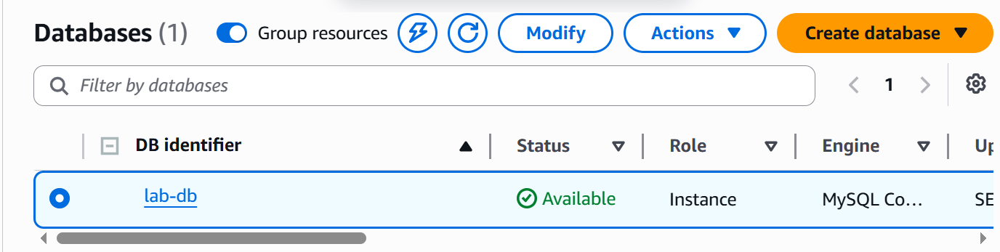
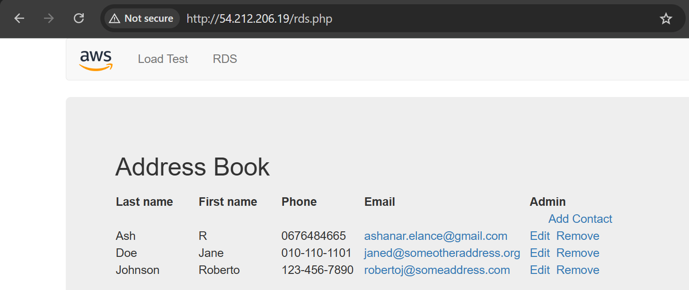

# ◈ Build Your Database Server and Interact with Your DB Using an App
**Course ID**: `160-[DF]-Lab`

## 🎯 Project Goal
The objective of this lab was to configure and deploy a highly available, managed relational database using Amazon RDS (MySQL) and establish secure network integration with an external web server. I practiced isolated network mapping, strict security group referencing, database engine provisioning, and application-to-database state verification.

## ⚙️ How it Works
* **Database Subnet Mapping**: I created a custom DB Subnet Group across two distinct Availability Zones inside the Lab VPC to define exactly where Amazon RDS could deploy database instances.
* **Least-Privilege Network Access**: I established a dedicated DB Security Group that strictly limits inbound MySQL traffic (Port 3306). Instead of using open IP ranges, the rule references the Web Security Group directly, allowing only authorized web servers to establish connections.
* **Multi-AZ Deployment**: I provisioned a Multi-AZ Amazon RDS MySQL DB instance. This automatically maintains a primary database instance in one Availability Zone while synchronously replicating transaction writes to a standby replica in a secondary zone.
* **App-to-DB Connection**: Using the RDS database writer endpoint, I configured a web application running on an EC2 instance to save transactional state data (adding, editing, and deleting contact entries) to a live schema.

## 📷 Lab Evidence
| Task | Description | Evidence |
| :--- | :--- | :--- |
| **3** | DB Instance Active & Available |  |
| **4** | Web App Database CRUD Verification |  |

## 🛠️ Lessons Learned & Optimization
* **Security Group Nesting**: Rather than whitelisting public or private IP addresses that can change when instances stop, start, or scale, I referenced the Web Security Group ID as the inbound traffic source. This ensures that any web server associated with that group can securely query the database, representing a dynamic security best practice.
* **Sandbox Provisioning Speed**: To optimize database build times during testing or training loops, disabling backups, performance metrics, and enhanced monitoring drastically speeds up initial cluster spin-up while still enabling complete integration verification.
* **Synchronous Multi-AZ Fault Tolerance**: Implementing a Multi-AZ architecture protects against single points of failure. If the primary Availability Zone experiences an outage, Amazon RDS handles DNS redirection internally to failover to the secondary replica without requiring connection string modifications in the application.

## 📊 Technical Competence
Amazon RDS Provisioning, DB Subnet Group Architecture, Multi-AZ High Availability, Security Group Nesting (Port 3306), PHP-MySQL Schema Integration, CRUD Application Persistence.
