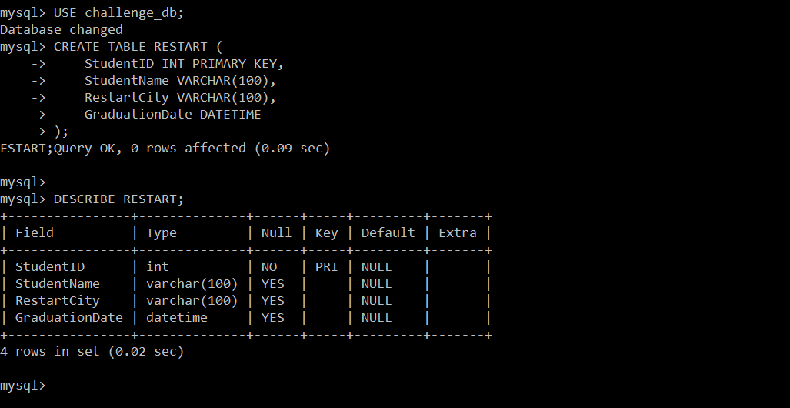
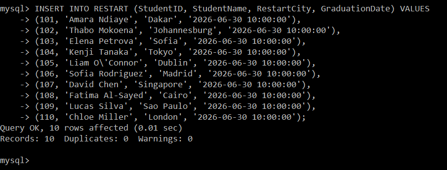
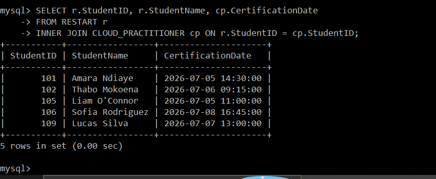
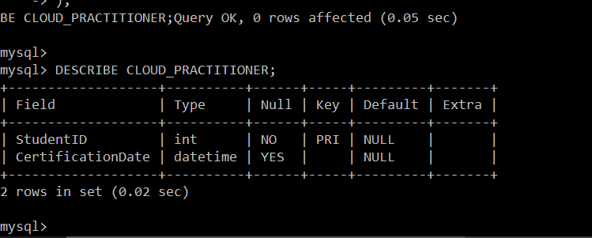
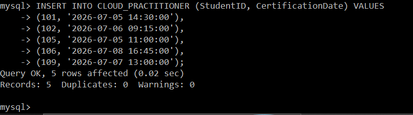
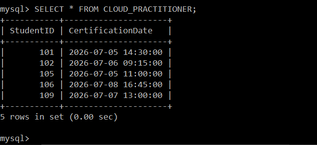
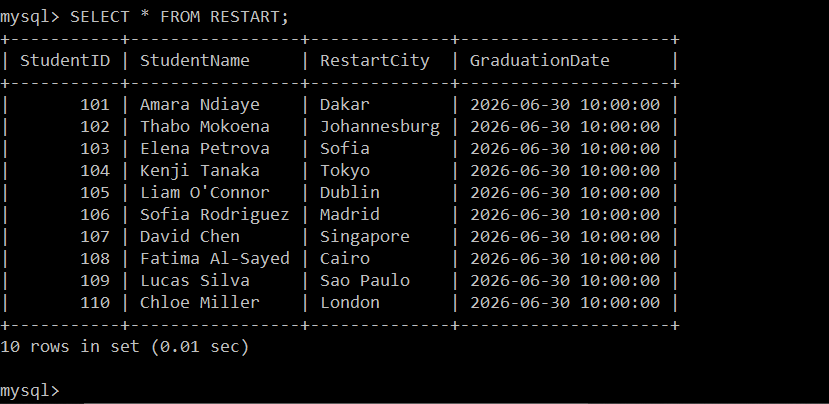

# ◈ RDS Database Server Build
**Course ID**: `162-[DF]-Lab`

## 🎯 Project Goal
The goal of this lab was to get hands-on experience provisioning and securing a highly available relational database in the cloud. I practiced deploying an Amazon RDS MySQL instance, configuring access control at the network layer, establishing a secure connection using a command-line client on an EC2 bastion host, and running SQL queries to structure, populate, and query related data sets.

## ⚙️ How it Works
Secure Private Architecture: I deployed an Amazon RDS MySQL database server inside a secure, private network configuration. Direct public access was disabled to keep the database isolated from the public internet.

Network Access Control: I managed the instance’s virtual firewall via Security Groups. I configured the RDS security group to only allow inbound MySQL traffic (Port 3306) coming directly and exclusively from the EC2 instance's private security group, implementing the security principle of least privilege.

Relational Schema Design: Once connected via the MySQL CLI client on the EC2 bastion, I initialized a custom schema (`challenge_db`) and constructed two tables: `RESTART` (to track global student data) and `CLOUD_PRACTITIONER` (to track professional cloud certification achievements). I populated both tables and ran an `INNER JOIN` query to dynamically link the datasets together.

## 📷 Lab Evidence
| Task | Description | Evidence |
| :--- | :--- | :--- |
| **1** | 'RESTART' Table Schema Design |  |
| **2** | Populate 'RESTART' Records |  |
| **3** | Verify Student Database Entries |  |
| **4** | 'CLOUD_PRACTITIONER' Table Schema |  |
| **5** | Populate Certification Records |  |
| **6** | Verify Active Certifications |  |
| **7** | Dynamic Table Inner Join Query |  |

## 🛠️ Lessons Learned & Optimization
Least Privilege Security: I learned first-hand how AWS prevents database exposure by decoupling compute resources from storage. Rather than opening database access to the entire VPC or public internet, nesting security groups (authorizing the EC2 SG directly inside the RDS SG) ensures that only our designated bastion host can knock on port 3306.

SQL client Setup on Amazon Linux: Because AWS keeps its images minimal and secure, the native MySQL CLI client was not pre-installed. I gained valuable troubleshooting experience setting up the proper MariaDB/MySQL package repositories manually using the OS command line before establishing my connection.

Data Normalization and Relational Joins: Normalizing the data into two distinct tables (`RESTART` and `CLOUD_PRACTITIONER`) prevented redundancy. By using a shared primary key (`StudentID`), I practiced writing clean, high-performing `INNER JOIN` statements to dynamically match certified students to their graduation records, showing the real-world efficiency of structured relational databases.

## 📊 Technical Competence
Amazon RDS Provisioning, Database Network Security Groups, Linux Command Line Packages, Relational Schema Normalization, SQL Table Creation, Foreign & Primary Key Constraints, SQL Joins.
