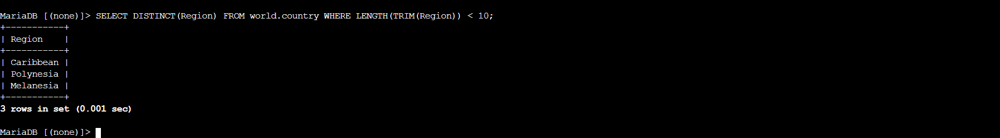
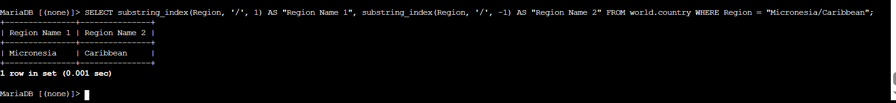

# Server-Side Relational Functions & Complex String Parsing Mechanics

## 🎯 Project Overview
In this lab workspace, I acted as an infrastructure data architect to implement both server-side scalar data cleaning routines and multi-column aggregate workflows inside a production engine environment. I focused on building optimized, computational queries that sanitize, manipulate, and split text strings directly inside the database cluster rather than handling formatting at the application software level.
 

## ⚙️ Core Technical Capabilities Demonstrated

### 1. Multi-Field Data Matrix Aggregations
* **Mathematical Operations Applied:** `SUM()`, `AVG()`, `MIN()`, `MAX()`, `COUNT()`
* **Process Reflection:** I performed structural database analysis by aggregating high-volume numerical metrics directly on the disk arrays. This generated a highly structured, single-row analytical summary of global population variables without the overhead of processing individual tabular columns.

### 2. Multi-Tiered Nested Text Formatting Checks
* **Scalar Operations Applied:** `LENGTH()`, `TRIM()`, `DISTINCT()`
* **Process Reflection:** I combined nesting string mechanics to strip out erroneous leading/trailing spacing variables before executing dimensional measurement actions. To refine the layout, I injected deduplication constraints (`DISTINCT`) to filter the output data matrix and remove repeating operational entries from my terminal stream.

### 3. Dynamic Substring Delimiter Ingestion
* **Command Syntax Applied:** `SUBSTRING_INDEX(Target, Delimiter, Index)`
* **Process Reflection:** For complex data transformations, I utilized positional tokenization parameters to look for specific split points (like whitespace and forward slashes `/`). This allowed me to split compound data strings into distinct, highly functional data columns.

## 📸 Lab Evidence

| Milestone Reference | Delivery Check | System Output Mapping |
| :---: | :--- | :--- |
| **Artifact 01** | Uniqueness Constraints and Deduplication |  |
| **Artifact 02** | Multi-Column Delimiter String Split |  |

## 🧠 Critical Key Takeaways

* **The Computational Value of Server-Side Manipulation:** This lab demonstrated why heavy text manipulation should live inside the database engine when designing cloud microservices. Processing operations like string clipping and calculations on-disk means our frontend application components only receive lean, perfectly formatted data objects, which saves memory overhead and lowers cloud bills.
* **Data Ingestion Hygiene Realities:** Working with queries like `LENGTH(TRIM(Region))` taught me that production enterprise data is rarely perfect. Raw text inputs frequently ship with hidden formatting errors or spaces, making formatting operations vital during data pipeline processing to ensure structural accuracy across downstream cloud services.
