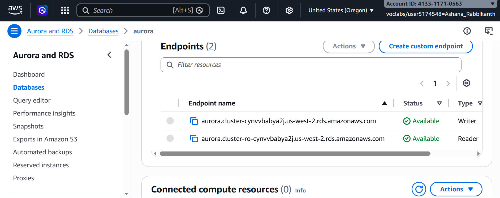
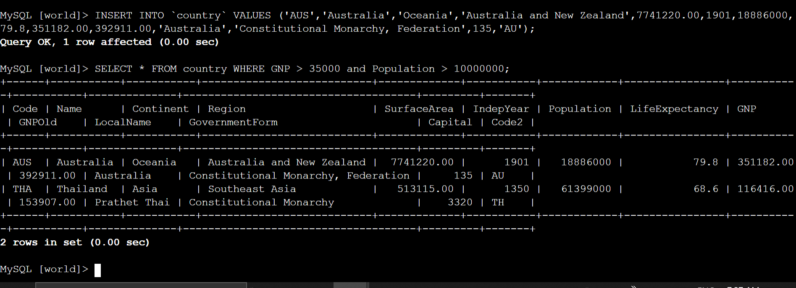

# ◈ Introduction to Amazon Amazon Aurora
**Course ID**: `274-[DF]-Lab`

## 🎯 Project Goal
The objective of this lab was to configure and deploy a high-performance, managed relational database cluster using Amazon Aurora (MySQL Compatible)[cite: 1]. I practiced setting up a highly available, provisioned database cluster, retrieving active endpoints, and establishing connection channels to perform transactional and analytical SQL operations from a client environment[cite: 1].

## ⚙️ How it Works
* **Highly Available Clustering**: I provisioned an Amazon Aurora database cluster across multiple Availability Zones, selecting standard configurations to optimize database performance, durability, and automated failover capabilities[cite: 1].
* **Database Connectivity**: I located and extracted the cluster-level **Writer Endpoint** from the AWS Console to route client application connection strings directly to the primary database instance[cite: 1].
* **Data Modeling and Query Execution**: Using the command-line interface, I established a secure connection to the `world` database, successfully executing transactions (`INSERT`) and structured analytical queries (`SELECT`) to interact with live production schemas[cite: 1].

## 📷 Lab Evidence
| Task | Description | Evidence |
| :--- | :--- | :--- |
| **2** | Cluster Writer and Reader Endpoints Created |  |
| **3** | Successful DB Connection & SQL Query Operations |  |

## 🛠️ Lessons Learned & Optimization
* **Writer vs. Reader Endpoints**: I learned that Amazon Aurora abstracts instance-level management by providing dedicated cluster endpoints[cite: 1]. Connecting to the **Writer Endpoint** guarantees write access to the primary database instance, while the **Reader Endpoint** load-balances read-only traffic across available replica instances to preserve system resources[cite: 1].
* **Scaling and Cost Optimizations**: To align with resource governance guidelines in a development sandbox, selecting burstable classes (like the `db.t3.medium`) and disabling unnecessary production add-ons (such as DevOps Guru and Enhanced Monitoring) minimizes runtime billing without sacrificing core performance during lab validations[cite: 1].
* **Targeting Specific Schemas on Boot**: Appending the database name (e.g., `world`) to the end of the `mysql` connection string saves operational overhead by establishing immediate access to the working schema, eliminating the need to manually run `USE database;` commands[cite: 1].

## 📊 Technical Competence
Amazon Aurora Provisioning, DB Cluster Lifecycle Management, Database Endpoint Integration, VPC Security Group Network Isolation, Relational Database Modeling, MySQL Client Connection & Query Verification[cite: 1].
