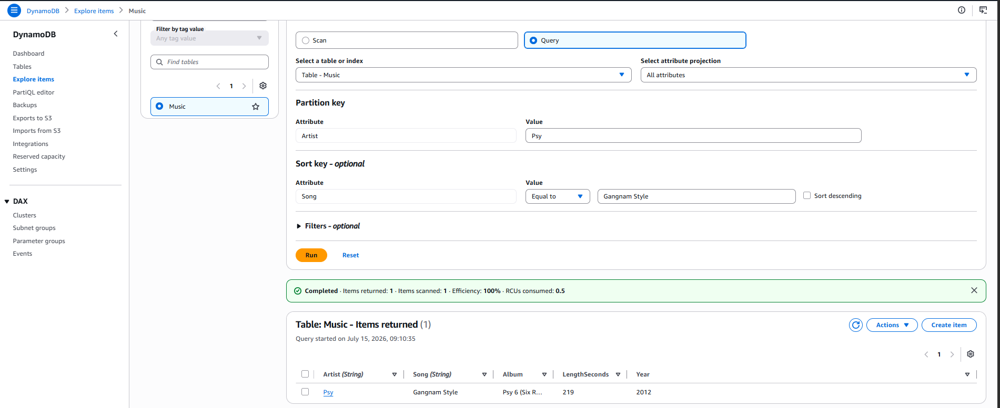
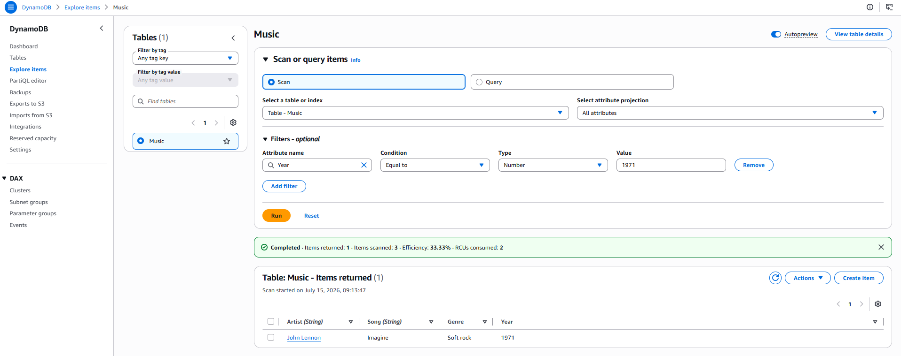

# ◈ Introduction to Amazon DynamoDB
**Course ID**: `275-[DF]-Lab`

## 🎯 Project Goal
The objective of this lab was to get hands-on experience provisioning and managing a fully managed NoSQL database using Amazon DynamoDB. I practiced creating a flexible table structure, performing schema-less data insertions with variable attributes, executing high-speed key queries, utilizing filter scans, and handling table lifecycle cleanup.

## ⚙️ How it Works
* **Schema-less Table Architecture**: I created a DynamoDB table named `Music` by defining only a primary key structure—using a Partition Key (`Artist`) and a Sort Key (`Song`) to uniquely identify database items.
* **Dynamic Data Insertion**: I manually populated multiple items into the table, inserting standard string/number fields while leveraging DynamoDB's NoSQL flexibility to add arbitrary attributes (like `Genre` and `LengthSeconds`) to specific items on the fly without pre-defining a table schema.
* **Low-Latency Queries**: I utilized the Query operation to retrieve specific item records directly via primary keys, demonstrating single-digit millisecond lookup performance.
* **Scans with Logical Filtering**: I ran Scan operations coupled with logical filters (e.g., retrieving items where `Year = 1971`) to evaluate non-key attributes across the entire table.

## 📷 Lab Evidence
| Task | Description | Evidence |
| :--- | :--- | :--- |
| **4** | Targeted Partition Key Query Verification |  |
| **4** | Attribute-Filtered Scan Execution |  |

## 🛠️ Lessons Learned & Optimization
* **Query vs. Scan Performance**: I learned the hard way that Queries are highly efficient because they leverage indexes to target specific partitions directly. Scans, on the other hand, systematically search the entire database table. In production, using Scans on large datasets introduces latency and consumes significant read capacity, so applications should be designed to query by keys whenever possible.
* **Schema Flexibility in Action**: Unlike traditional relational databases (like RDS MySQL) where columns must be altered globally to add new data points, DynamoDB allowed me to add `LengthSeconds` to only one record without affecting the rest. This is highly beneficial for rapidly evolving application schemas or unstructured JSON payloads.
* **In-Place Item Modifications**: I discovered how simple it is to edit individual item attributes in place via the DynamoDB console or API. Updating the release year for an artist was instantaneous and did not require any table-level locks or migration scripts.

## 📊 Technical Competence
NoSQL Database Provisioning, Partition Key and Sort Key Selection, Schema-less Data Modeling, Document/Key-Value Data Manipulation, Index Queries, Full Table Scans with Filtering.
