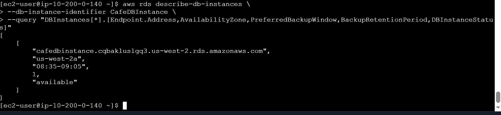
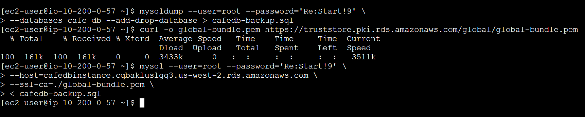
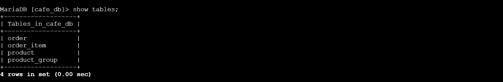
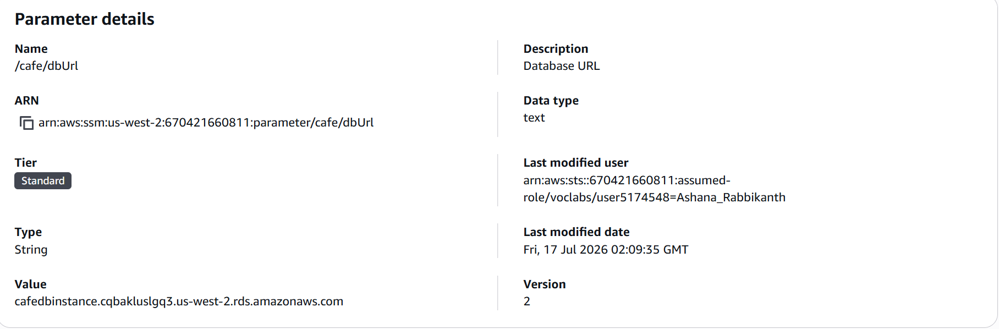
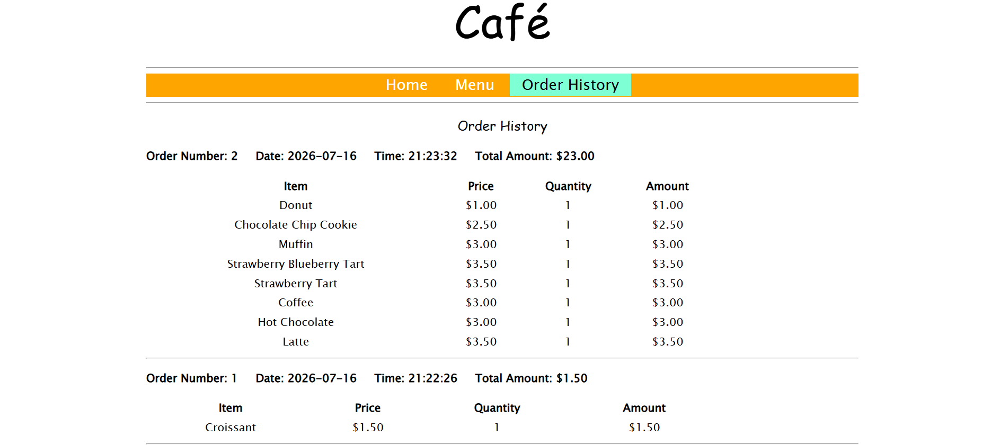
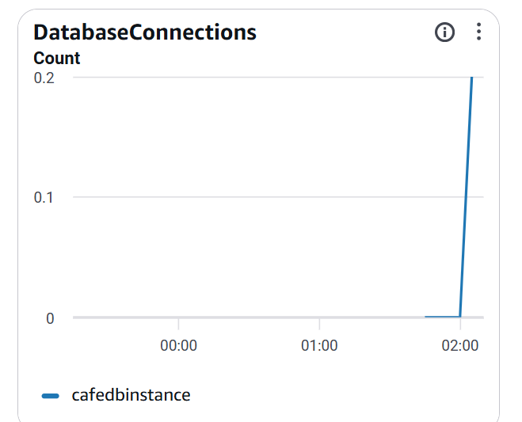

# ◈ Migrating to Amazon RDS
**Course ID**: `179-[JAWS]-Activity`

## 🎯 Project Goal
The goal of this lab was to migrate a local monolithic database running inside a public EC2 instance (LAMP stack) to a fully managed, high-availability database tier using Amazon Relational Database Service (Amazon RDS) MariaDB. This decoupled architecture improves application scaling, enhances security by moving data to private subnets, and simplifies database maintenance.

## ⚙️ How it Works
**Data Baseline Generation**: I interacted with the live café application frontend to place a series of orders, intentionally generating realistic transaction records inside the local database to verify successful end-to-end migration later.

**Secure Network Infrastructure via AWS CLI**: Using the command line on a management host, I built the isolated target network. I created two private subnets across distinct Availability Zones (`us-west-2a` and `us-west-2b`), grouped them into an RDS DB Subnet Group, and established a specialized security group (`CafeDatabaseSG`) configured with strict ingress rules allowing MySQL/MariaDB traffic (Port 3306) exclusively from the application server.

**Provisioning & Data Migration**: I deployed a fully managed Amazon RDS MariaDB instance securely within the private subnets. I then used `mysqldump` to export the local database schema and records from the web server, downloaded the global Amazon RDS CA certificate bundle to handle required SSL/TLS encryption, and restored the data directly into the remote RDS instance.

**Application Decoupling & Monitoring**: To cut over to the new system without editing application code, I updated the database connection string endpoint within the AWS Systems Manager Parameter Store (`/cafe/dbUrl`). Finally, I kept an interactive database session open to monitor active metrics collection within the Amazon CloudWatch RDS console dashboard.

## 📷 Lab Evidence
| Task | Description | Evidence |
| :--- | :--- | :--- |
| **2** | RDS Database Instance Provisioned & Available |  |
| **3** | Local Database Export and Remote RDS Restore |  |
| **3** | Relational Table Structure Verification in RDS |  |
| **4** | Parameter Store Endpoint Redirection Update |  |
| **4** | Live Café Web Application History Validation |  |
| **5** | Amazon CloudWatch Active Session Connection Monitoring |  |

## 🛠️ Lessons Learned & Optimization
**Troubleshooting Minor Engine Discrepancies**: During database creation via the AWS CLI, the static lab manual configuration specified a minor engine version (`10.11.11`) that was deprecated or unavailable in the local cloud sandbox region. By leveraging `describe-db-engine-versions` with targeted JSON queries, I listed the active region-supported versions, adjusted the parameter payload to `10.11.13`, and unblocked the deployment smoothly.

**The Power of Externalized Configurations**: Migrating the application database from a local instance to a remote cloud architecture did not require modifying individual backend application files or lines of PHP code. Because the application was built using modern cloud native practices, it pulled its environment settings directly from the AWS Systems Manager Parameter Store. Updating the centralized `/cafe/dbUrl` key shifted all live web traffic instantly, demonstrating how decoupling code from infrastructure parameters prevents configuration drift and manual errors.

**Network Isolation Safeguards**: By implementing an RDS DB Subnet Group utilizing entirely private subnets, the database layer was completely insulated from the public internet. Restricting database access strictly to the web server's Security Group ID ensures a zero-trust perimeter, making the backend data unreachable from outside the VPC even if the main site is compromised.

## 📊 Technical Competence
Amazon RDS Provisioning, Database Migration Lifecycles (`mysqldump`), Multi-AZ Private Subnet Layouts, Database Subnet Group Design, AWS Systems Manager Parameter Store, Amazon CloudWatch Metric Monitoring, Secure SSL/TLS Database Connectivity, Network Security Group Ingress Control.
