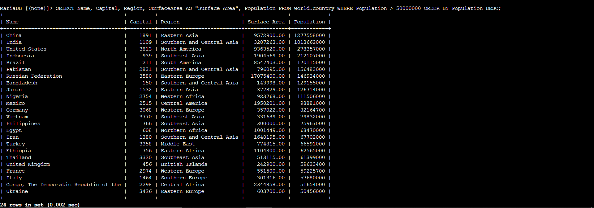
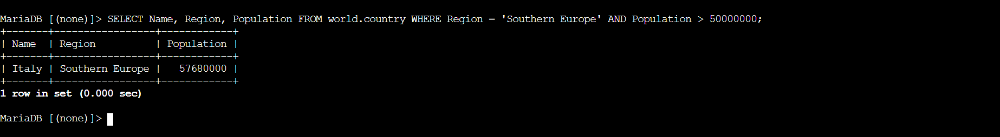

# Data Retrieval Architectures & Conditional Relational Filtering

## 🎯 Project Overview
In this lab workspace, I acted as a data analyst to query a structured relational database container. I utilized Data Query Language (DQL) structures to selectively extract dataset metrics, run aggregation functions, apply column aliases for front-facing scannability, and deploy multi-conditional logical operators to filter high-volume data matrices.

## ⚙️ Core Technical Capabilities Demonstrated

### 1. Matrix Aggregation & Schema Evaluation
* **Commands Applied:** `COUNT(*)`, `SHOW COLUMNS`
* **Process Reflection:** Before writing queries, I ran structural scans to discover underlying tables constraints. Utilizing aggregate checking mechanisms allowed me to establish a baseline record count without overloading my client terminal shell buffer.

### 2. Multi-Conditional Boundary Filtering
* **Operators Applied:** `WHERE`, `AND`, `>`, `<`
* **Process Reflection:** I engineered precise relational boundaries by pairing comparison operators with logical intersections (`AND`). This methodology allowed me to parse deep datasets and selectively isolate row arrays falling within specific numeric windows (between 50M and 100M).

### 3. Output Matrix Sorting & Presentation Layers
* **Options Applied:** `AS "Aliased Name"`, `ORDER BY ... DESC`
* **Process Reflection:** To ensure output data was prepared cleanly for application layer consumption or business intelligence formatting, I leveraged aliases to overwrite raw database naming conventions and implemented reverse sorting indexing (`DESC`) to stack high-priority metrics on top.

## 📸 Lab Evidence

| Milestone Reference | Administrative Operation Verified | System Output Mapping |
| :---: | :--- | :--- |
| **Artifact 01** | High-Volume Logical Boundary Query |  |
| **Artifact 02** | Targeted Regional Challenge Extraction |  |

---

## 🧠 Critical Key Takeaways

* **Server-Side Filtering vs. Client-Side Overhead:** This lab highlighted why experienced engineers filter data directly at the database engine level instead of pulling raw datasets (`SELECT *`) into an application shell. Running granular `WHERE` queries minimizes network transit overhead, reduces compute pressures on frontend servers, and optimizes cloud resource efficiency.
* **Indexing and Sorting Efficiencies:** Utilizing sorting mechanics (`ORDER BY`) underscored the absolute necessity of query optimization. In scaled cloud spaces, running sorting processes on unindexed columns across millions of database rows can introduce massive input/output latency, meaning structural index planning is crucial for production cloud architectures.
