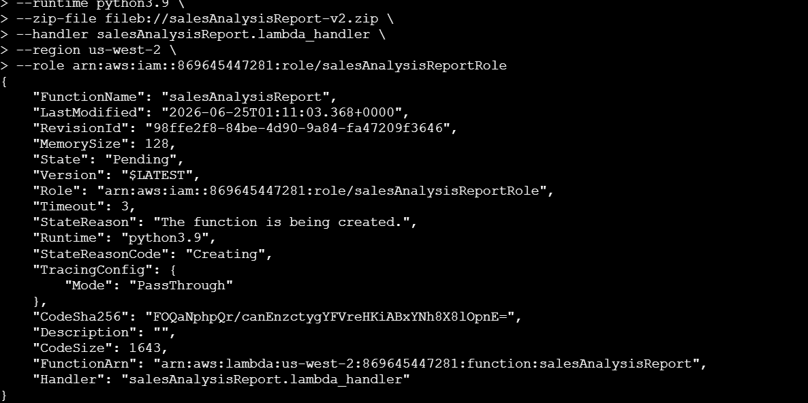
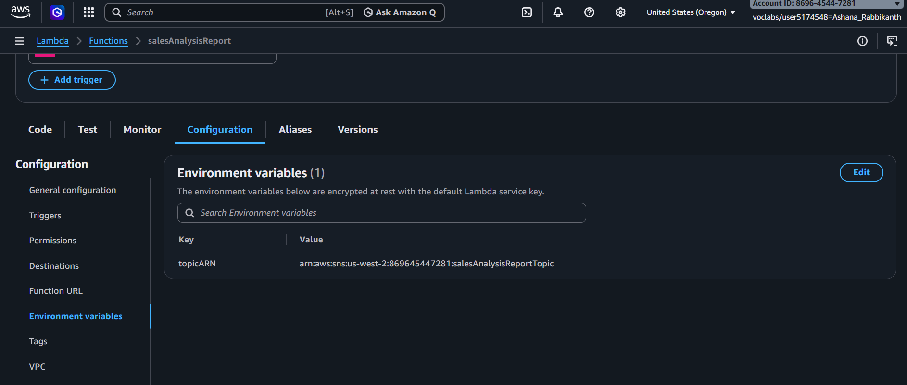
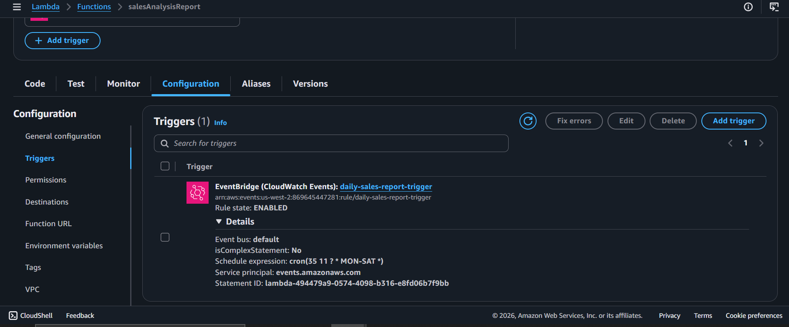
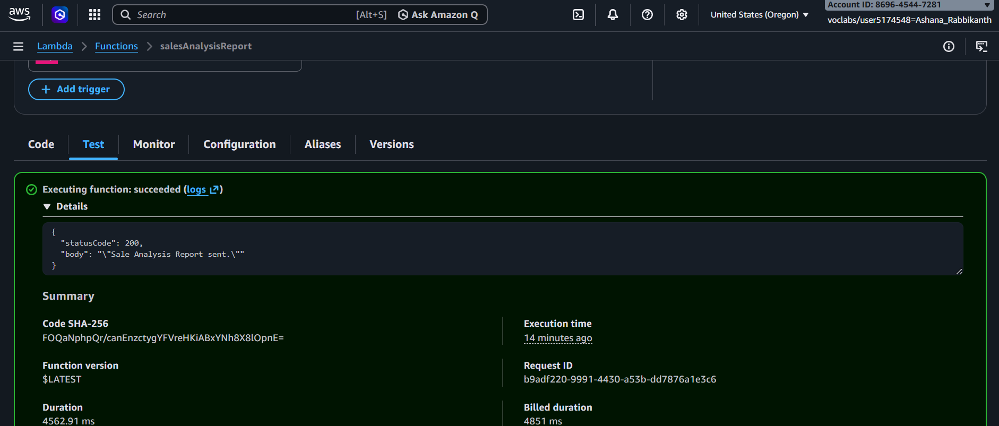

# AWS Lambda Event-Driven Foundations

**Course ID:** 178-[JAWS]-Activity

---

## 🎯 Project Goal
The goal of this project was to move away from traditional, always-running servers and learn how to build serverless, event-driven workflows. I practiced writing modular AWS Lambda functions, configuring automated schedule triggers using Amazon EventBridge, and decoupling application logic so that code only executes on demand when an event occurs.

---

## ⚡ How it Works
* **Automated Event Triggers:** I used Amazon EventBridge to set up a cron-based schedule that automatically kicks off my report generation workflow at a specific time without any human intervention.
* **Decoupled Architecture:** To follow cloud development best practices, I split the application logic into two separate, specialized Lambda functions:
  * `salesAnalysisReportDataExtractor`: Sits inside a secure private VPC to pull raw transactional data from a database using credentials stored safely in Systems Manager (SSM) Parameter Store.
  * `salesAnalysisReport`: Formats the extracted data into a clean layout and pushes a downstream notification to users via Amazon SNS.
* **Dependency Optimization:** Instead of bundling heavy external Python libraries (like PyMySQL) directly into my function zip files, I packaged them into a reusable Lambda Layer to keep my code clean and speed up function startup times.

---

### 📷 Lab Evidence

| Task | Delivery Check | Evidence |
| :---: | :--- | :--- |
| **1** | Lambda Function & Layer Creation |      |
| **2** | Event Source (EventBridge) Mapping |  |
| **3** | Troubleshooting & Log Analysis |  |

---

## 🛠️ Lessons Learned & Optimization
* **Beating the 3-Second Timeout:** During initial testing, my data extractor function kept crashing with a frustrating `Task timed out` error. I realized that forcing a Lambda function inside a private subnet to spin up an elastic network interface (ENI) and shake hands with a MySQL database takes a few seconds. The default 3-second timeout wasn't enough. Increasing the execution timeout limit and double-checking my database Security Group rules to explicitly allow Port 3306 traffic fixed the issue completely.
* **The Layer Advantage:** Bundling dependencies with your main script makes editing code in the AWS Console impossible once the file size gets too large. Moving the PyMySQL library into a Lambda Layer allowed me to keep my actual function code under a few lines of readable text, making troubleshooting a breeze.
* **Designing for High Reliability:** If I were moving this serverless workflow to production, I wouldn't leave failures to chance. I would attach a Dead Letter Queue (DLQ) using Amazon SQS to catch any failed function executions so we could analyze bad data loads without dropping them entirely. I would also store environmental configurations like our SNS Topic ARNs inside SSM Parameter Store so the code stays portable when migrating between staging and production environments.

---

## 📊 Technical Competence
* Serverless Architecture (FaaS)
* Event-Driven Triggering (EventBridge Cron)
* Lambda VPC Networking & Security Groups
* Lambda Layer Management
* IAM Role & Trust Policies
* Amazon SNS Orchestration
