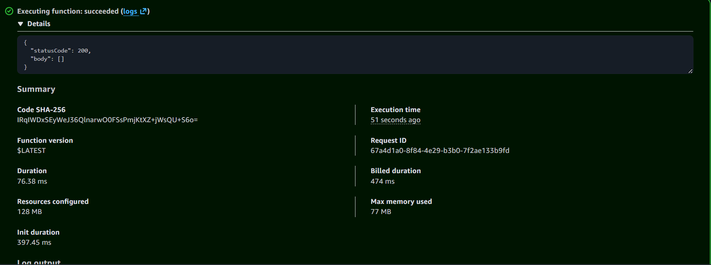
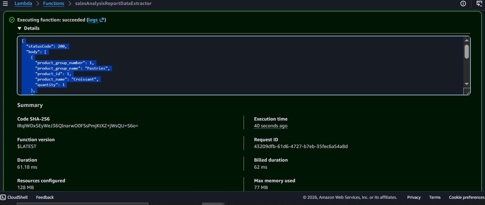

# ◈ Serverless Architecture Challenge
**Course ID**: `177-[JAWS]-Lab`

## 🎯 Project Goal
The goal of this project was to tackle an advanced serverless architecture challenge by building a fully event-driven data processing pipeline. I designed a system where an file upload to Amazon S3 acts as an automatic data ingest layer, kicking off an AWS Lambda function to perform real-time text analysis, which then passes the results asynchronously to users via Amazon SNS.

## 🛡️ How it Works
S3 Event Ingestion: I configured S3 "Object Created" event notifications to act as an automated trigger mechanism. The moment a text file hits the bucket, the system automatically spins up the compute layer to handle it.

Compute & Notification Pipeline: I wrote a Python-based Lambda function to read the uploaded files, count specific data metrics, and forward a summary report down to an Amazon SNS topic for immediate distribution.

Access Control & Permissions: I attached a dedicated execution role to my Lambda function, ensuring it had the necessary IAM permissions to read objects out of S3, write logs to CloudWatch, and publish alerts to SNS securely.

## 📷 Lab Evidence

| Task | Integration Milestone | Evidence |
| :---: | :--- | :--- |
| **1** | S3 Event-Trigger & Processing Logic |  |
| **2** | End-to-End Pipeline Validation |  |

## 🛠️ Lessons Learned & Optimization
The Silent Trigger Failure: During initial testing, uploading a text file to my bucket did absolutely nothing—the Lambda function wasn't even attempting to run. I learned that just because you hook up a trigger in S3 doesn't mean S3 has permission to talk to Lambda. I had to audit the Lambda function's Resource-Based Policy and explicitly grant the S3 service principal (s3.amazonaws.com) the lambda:InvokeFunction authority. Once that policy was updated, the data pipeline clicked into place perfectly.

Decoupled Asynchronous Workflows: Building this pipeline reinforced the power of serverless decoupling. Because S3, Lambda, and SNS handle their own scaling independently, the system doesn't need to waste money running idle server infrastructure while waiting for data to arrive.

Scaling for Sudden Spikes: If this text processing pipeline were deployed in a real-world production app facing sudden file upload spikes, letting S3 trigger Lambda directly could cause us to hit concurrent execution limits. To optimize this, I would throw an Amazon SQS (Simple Queue Service) queue between S3 and Lambda to act as a buffer. This would hold the incoming files safely in a line, smoothing out processing spikes and preventing data loss.

## 📊 Technical Competence
Serverless Event Orchestration, S3 Event Notification Rules, Lambda Resource-Based Policies, Python Compute Logic, Amazon SNS Topic Management, Asynchronous Architecture Design.
