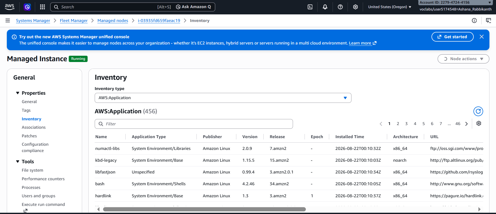
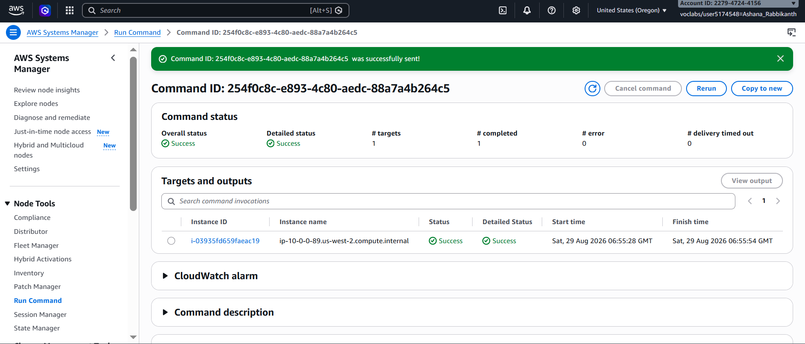
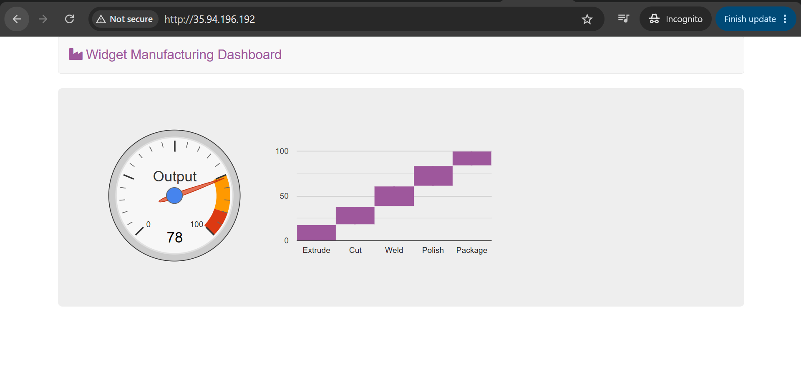
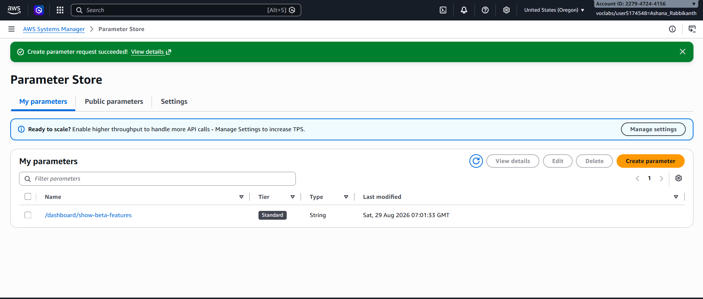
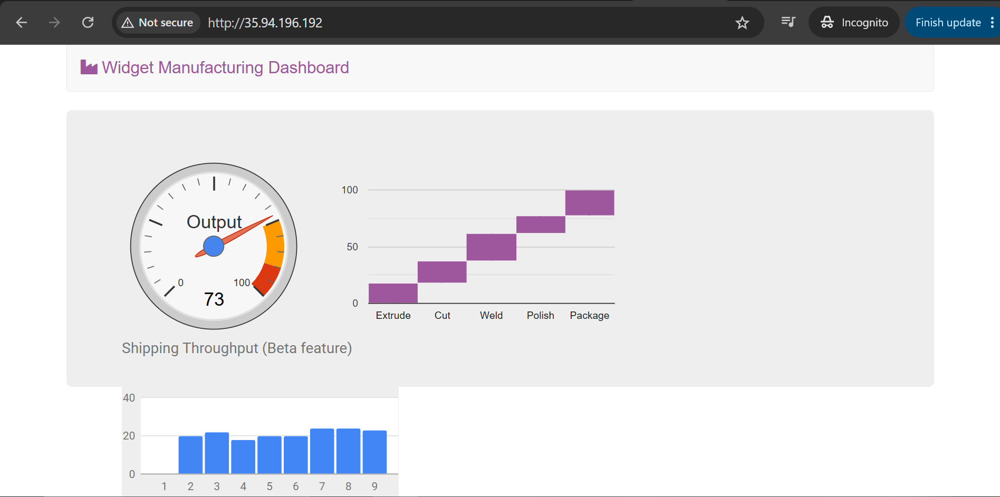
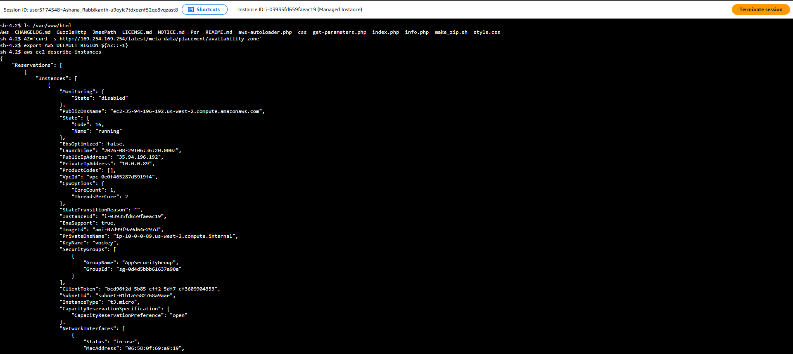

# AWS Systems Manager Foundations

**Course ID:** 169-[JAWS]-Lab

---

## 🚀 Lab Goal
The goal of this project was to move away from manually connecting to individual servers via SSH and learn how to centralize operational management across AWS infrastructure. I practiced managing server configurations at scale, running commands across multiple instances simultaneously using AWS Systems Manager, dynamically altering application behavior using Parameter Store, and establishing secure, browser-based command line access without exposing open SSH ports.

---

## ⚙️ How it Works
* **Fleet Inventory Collection:** I configured Systems Manager Fleet Manager to automatically collect operating system, application, and metadata properties across my managed instances so I can audit installed software without remoting into individual boxes.
* **Automated Application Deployment:** Instead of SSHing into individual instances to run bash scripts manually, I used Systems Manager Run Command to execute custom deployment scripts across target instances to spin up an Apache web server, PHP, AWS SDK, and the Widget Dashboard application.
* **Dynamic Configuration Management:** I leveraged Systems Manager Parameter Store as a centralized, hierarchical configuration key-value store (`/dashboard/show-beta-features`). The web application dynamically queries Parameter Store to unlock hidden "beta" features without requiring a code redeployment or server restart.
* **Secure, Bastion-Free Administration:** I used Session Manager to open an interactive command-line shell directly in my browser tab, eliminating the need to manage SSH keys, run public-facing bastion hosts, or open inbound Port 22 in Security Groups.

---

### 📸 Lab Evidence

| Task | Delivery Check | Evidence |
| :---: | :--- | :--- |
| **1** | Fleet Inventory Management |  |
| **2** | Application Deployment via Run Command |      |
| **3** | Dynamic App State via Parameter Store |      |
| **4** | Browser-Based Shell Access via Session Manager |  |

---

## 🧠 Lessons Learned & Optimization
* **Streamlining Fleet Configuration:** Relying on manual SSH connections to configure or patch servers creates massive operational bottlenecks as fleets grow. Using Systems Manager Run Command allows operations teams to execute scripts predictably against thousands of instances using simple tag targeting, drastically reducing manual administration overhead.
* **Decoupling Application Logic with Parameter Store:** Storing feature flags directly inside application code forces unnecessary redeployments whenever a feature needs to toggle on or off. Routing feature flags through SSM Parameter Store decoupled our application runtime logic from configuration state, enabling seamless "dark launches" of beta functionality instantly.
* **Tightening Security Profiles:** Opening Port 22 to allow inbound SSH traffic introduces significant attack vectors and increases access management complexity. Utilizing Session Manager allows administrators to enforce strict IAM access policies and log every command execution to AWS CloudTrail, providing auditability while keeping instance security groups tight and locked down.

---

## 🛠️ Technical Competence
* AWS Systems Manager (SSM)
* SSM Fleet Manager & Inventory Trackers
* SSM Run Command & Document Executions
* SSM Parameter Store (Configuration Management)
* SSM Session Manager (Secure Terminal Access)
* AWS IAM Policies & Least Privilege Access
* Remote Application Deployment Automation
