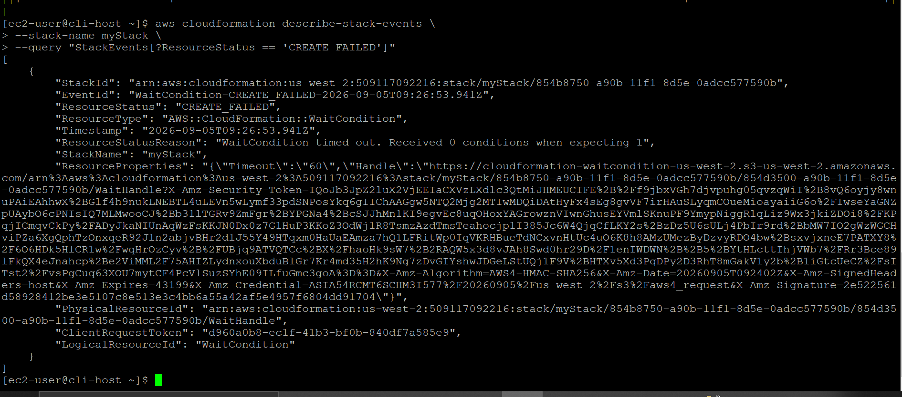
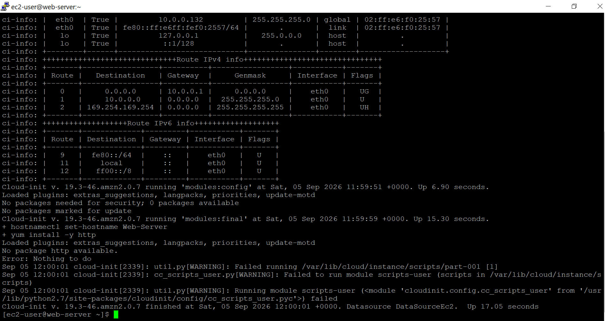
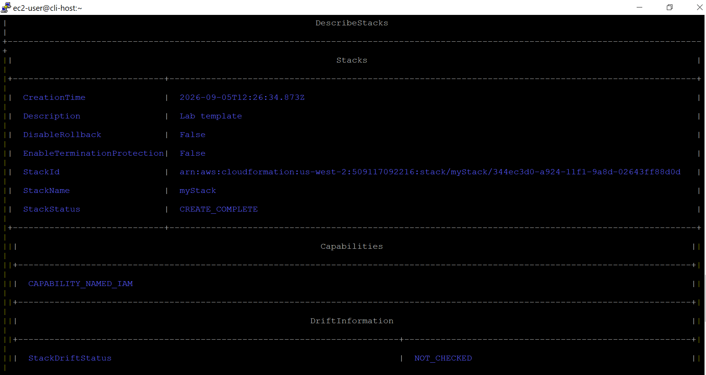
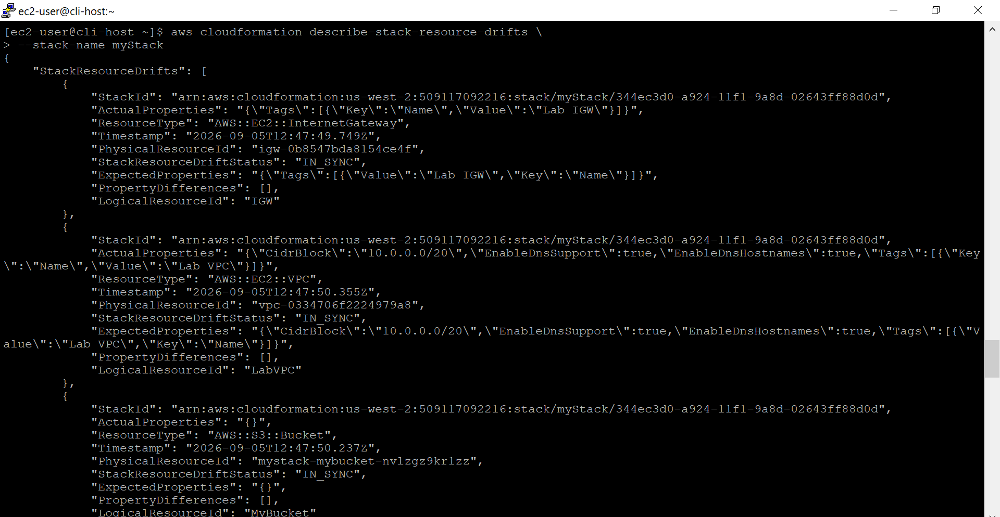

# AWS CloudFormation Deployment & Drift Troubleshooting

**Course ID:** 191-[JAWS]-Activity

---

## 🎯 Lab Goal
The goal of this project was to gain hands-on experience troubleshooting failed Infrastructure as Code (IaC) deployments, diagnosing runtime boot errors, and detecting configuration drift using AWS CloudFormation. I practiced writing modular YAML templates, debugging system startup failures via CloudWatch and SSH, managing stack lifecycle rollback options, and auditing out-of-band infrastructure changes.

---

## ⚙️ How it Works
* **Automated Provisioning & Rollback Control:** I defined multi-resource stacks using AWS CloudFormation YAML templates, utilizing parameters like `--on-failure DO_NOTHING` to preserve failing instances for live root-cause debugging rather than triggering instant stack rollbacks.
* **Boot-Level Debugging:** When the initial stack deployment failed, I accessed the provisioned EC2 instances to inspect `/var/log/cloud-init-output.log` and `/var/lib/cloud/instance/scripts/part-001`, pinpointing user data package manager typos preventing web server installation.
* **Drift Detection & Lifecycle Retention:** After re-deploying the corrected stack and verifying live HTTP web traffic, I introduced manual security group modifications out-of-band and executed CloudFormation drift detection. Finally, I tested resource retention controls by applying `--retain-resources` during stack deletion to protect S3 data stores.

---

### 📷 Lab Evidence

| Task | Delivery Check | Evidence |
| :---: | :--- | :--- |
| **1** | CloudFormation Stack Failure Analysis |      |
| **2** | Stack Re-Deployment & Web Verification |  |
| **3** | Drift Detection & Out-of-Band Auditing |  |
---

## 💡 Lessons Learned & Optimization
* **Diagnosing Cloud-Init Package Failures:** During the initial deployment, the stack hung at the `WaitCondition` step before rolling back. By preserving the instance and checking the cloud-init execution logs, I identified that `yum install -y http` was failing because the Amazon Linux package name is `httpd`. Correcting the package name in the template's `UserData` section restored successful stack signaling via `cfn-signal`.
* **Managing Editor Precision in YAML:** When modifying template syntax in terminal environments using `vim`, stray line numbers or mode toggles can break YAML parsing. Discovering and removing a stray `128` prepended to `AWSTemplateFormatVersion` highlighted the necessity of validating template formatting before triggering new stack creations.
* **State Management & State Drift:** Manually modifying security groups (e.g., authorizing Port 22 SSH access directly via the EC2 CLI) immediately causes infrastructure state drift. CloudFormation's drift detection pinpointed the exact security group rule discrepancy without affecting running instances, proving why IaC state audits are critical before applying stack update operations.
* **Designing for Data Persistence:** Deleting a CloudFormation stack normally tears down every managed resource. Utilizing `--retain-resources` allowed me to safely preserve our S3 bucket and its uploaded contents while removing the compute and network tiers, demonstrating how to protect persistent storage assets during stack refactoring.

---

## 🛠️ Technical Competence
* Infrastructure as Code (AWS CloudFormation)
* Automated Stack Provisioning & Rollback Management
* Linux Boot Diagnostic Logging (`cloud-init`)
* Systemd & HTTP Web Server Administration
* Out-of-Band Drift Detection & State Auditing
* S3 Lifecycle Retention & Data Preservation
