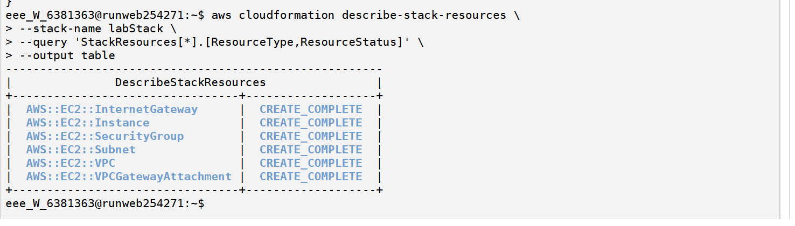

# ◈ CloudFormation Automation Challenge
**Course ID**: `192-[JAWS]-Lab`

# Using AWS CloudFormation to Create an AWS VPC and Amazon EC2 Instance

This lab focused on using AWS CloudFormation to deploy infrastructure as code (IaC) in order to create a basic AWS environment. The environment consisted of a Virtual Private Cloud (VPC), Internet Gateway, subnet configuration, security group rules, and an EC2 instance deployed inside the network.

The purpose of the lab was to build and troubleshoot a CloudFormation template through iterative testing until all required resources were successfully deployed.

## Solution

I started by accessing the AWS CLI environment and verifying that my credentials were properly configured. I confirmed access using the identity command.

```bash
eee_W_6381363@runweb254271:~$ aws sts get-caller-identity                                    
{                                                                                            
    "UserId": "AROAWVFRNTIRDWHPMZBE:user5174548=Ashana_Rabbikanth",                           
    "Account": "048665554129",                                                               
    "Arn": "arn:aws:sts::048665554129:assumed-role/voclabs/user5174548=Ashana_Rabbikanth"      
} 

```

2. Create CloudFormation Stack:

```bash
aws cloudformation create-stack \
  --stack-name labStack \
  --template-body file://template.yaml

```
3. Monitor Stack Resource Status:

```bash
aws cloudformation describe-stack-resources \
  --stack-name labStack \
  --query 'StackResources[*].[ResourceType,ResourceStatus]' \
  --output table

```

### 📷 Lab Evidence

| Task | Delivery Check | Evidence |
| :---: | :--- | :--- |
| **1** | AWS CLI Authentication | ```json<br>{<br>    "UserId": "AROAWVFRNTIRDWHPMZBE:user5174548=Ashana_Rabbikanth",<br>    "Account": "048665554129",<br>    "Arn": "arn:aws:sts::048665554129:assumed-role/voclabs/user5174548=Ashana_Rabbikanth"<br>}<br>``` |
| **2** | Stack Resource Deployment |  |

---

## 💡 Lessons Learned & Optimization
* **Handling Region-Specific Hardcoded AMIs:** Initial template deployments resulted in rollbacks because hardcoded AMI IDs are tied to specific regions. Implementing SSM Parameter Store references (`/aws/service/ami-amazon-linux-latest/...`) decoupled the template from hardcoded values, ensuring robust cross-region execution.
* **Managing Stack Name Conflicts:** Encountering `AlreadyExistsException` errors after stack rollbacks taught me the importance of cleaning up existing stack states or utilizing unique stack naming (`labStack`) during iterative re-deployments.
* **Overcoming Terminal Restrictions:** Working within browser-based labs with copy-paste restrictions required leveraging internal file editors for script adjustments and utilizing shell history shortcuts to streamline deployment commands.
* **Iterative Infrastructure Debugging:** Small indentation or configuration mistakes in CloudFormation templates immediately trigger rollbacks, reinforcing why methodical verification of template syntax is essential for successful IaC delivery.

---

## 🛠️ Technical Competence
* Infrastructure as Code (AWS CloudFormation)
* AWS Systems Manager (SSM) Parameter Store (Dynamic AMIs)
* Amazon VPC, Subnets, Internet Gateways & Security Groups
* Amazon EC2 Instance Provisioning & Tagging
* AWS CLI Stack Lifecycle Management & JMESPath Querying


  
