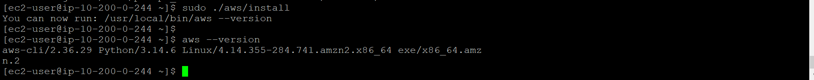
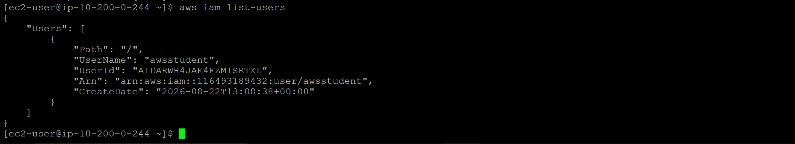
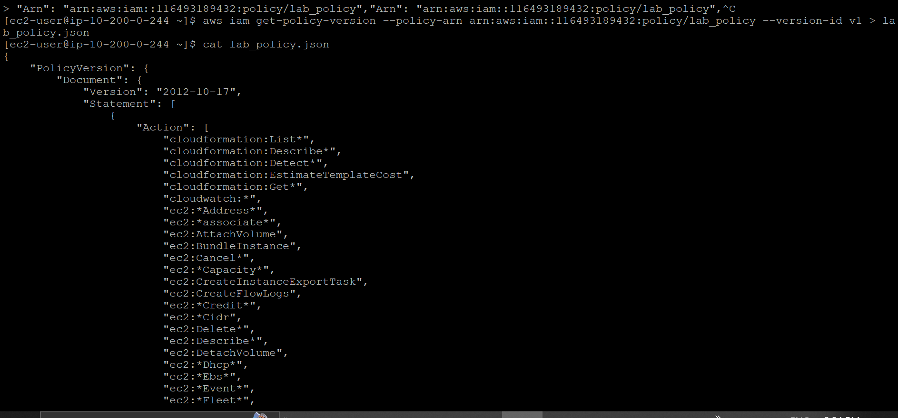

# AWS CLI Setup and IAM Configuration

**Course ID:** 168-[JAWS]-Activity

---

## 🎯 Lab Goal
The goal of this project was to move away from relying entirely on the AWS Management Console and transition toward command-line administration. I practiced downloading, compiling, and configuring the AWS Command Line Interface (AWS CLI v2) on a fresh Red Hat Enterprise Linux instance, verifying programmatic credentials, and interacting with IAM resources directly from the terminal.

---

## ⚙️ How it Works
* **Manual Engine Installation:** Because Red Hat Linux doesn't include the AWS CLI out of the box like Amazon Linux does, I downloaded the AWS CLI v2 installation package using `curl`, unzipped the binaries, and installed them system-wide using `sudo ./aws/install`.
* **Programmatic Authentication:** Instead of logging in with a username and password, I bound the local CLI session to the AWS Cloud by executing `aws configure`, entering programmatic access keys, setting the default region (`us-west-2`), and specifying JSON as the default output format.
* **CLI Identity & Access Verification:** I tested my programmatic access by querying IAM resources via the CLI, using `aws iam list-users` to pull active identities and using `aws iam get-policy-version` to export specific customer-managed IAM policies directly into local `.json` files.

---

### 📷 Lab Evidence

| Task | Delivery Check | Evidence |
| :---: | :--- | :--- |
| **1** | AWS CLI v2 Installation Verification |  |
| **2** | Programmatic API Authentication Check |  |
| **3** | IAM Policy Retrieval & Local JSON Export |  |

---

## 💡 Lessons Learned & Optimization
* **Managing CLI Session Scopes:** During identity testing, I learned that running `aws iam list-policies` returns hundreds of AWS-managed global policies by default. Scoping the query down using the `--scope Local` flag allowed me to immediately isolate custom managed policies like `lab_policy` without sifting through noise.
* **Redirecting API Outputs:** Using shell redirection (`> lab_policy.json`) alongside `aws iam get-policy-version` made it effortless to convert live AWS IAM configurations into version-controlled JSON files locally, showing how easy it is to document cloud security rules directly from the terminal.
* **Designing for High Reliability:** In a production setting, hardcoding access keys via `aws configure` on an EC2 instance isn't ideal security hygiene. The best-practice optimization would be attaching an IAM Role directly to the EC2 instance using an Instance Profile. This allows the CLI to auto-rotate temporary credentials via the EC2 Metadata Service (IMDSv2), eliminating static long-term secrets entirely.

---

## 🛠️ Technical Competence
* AWS CLI v2 Installation & Path Configuration
* Programmatic Credentials & AWS Profile Management
* Red Hat Enterprise Linux (RHEL) Package Handling
* IAM Policy Parsing & Local JSON Redirection
* Linux SSH Key-Based Authentication
