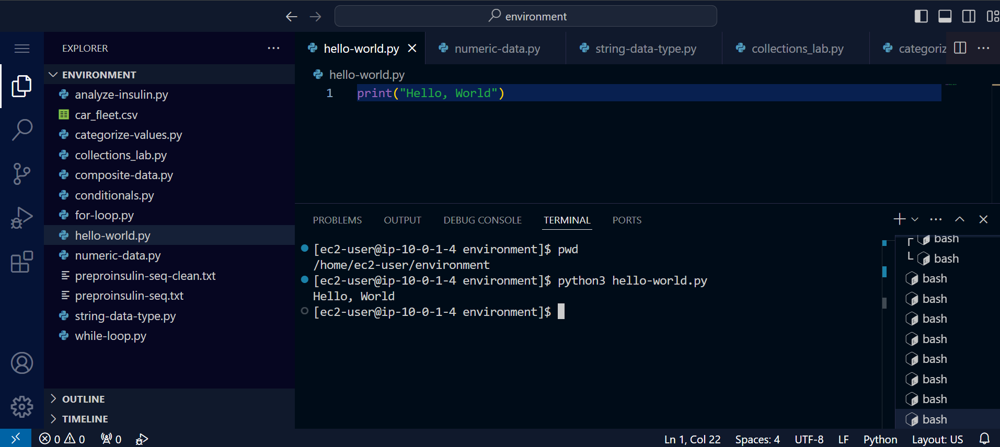
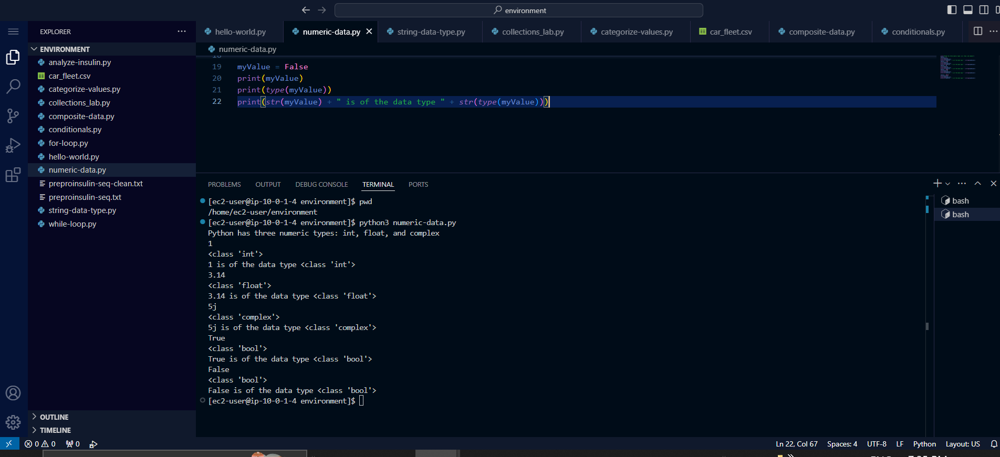
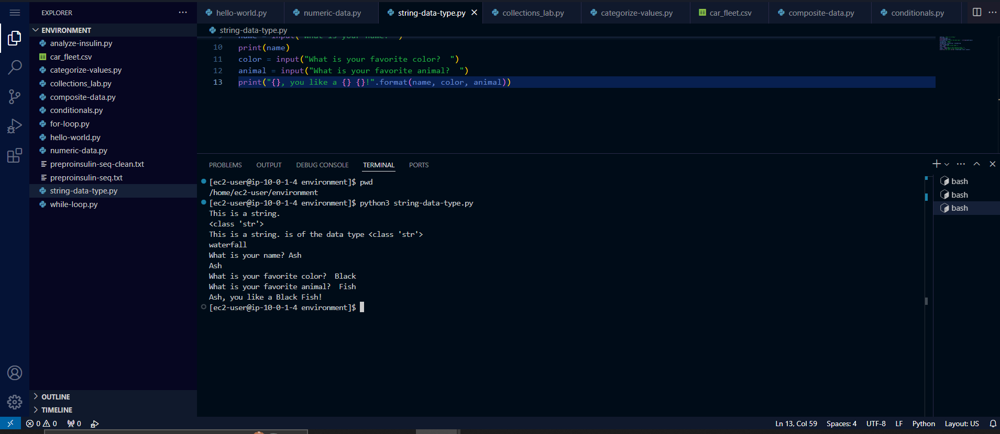
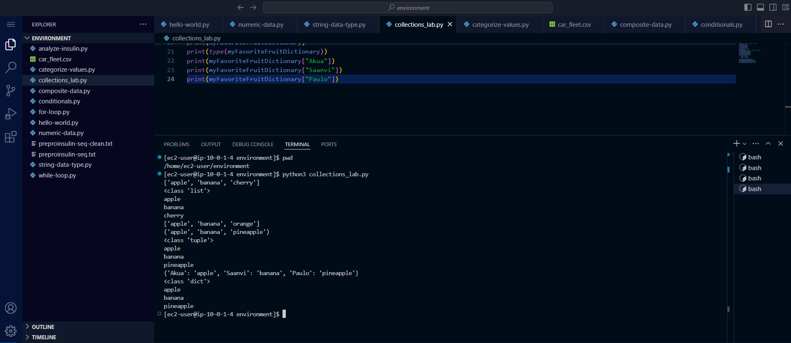
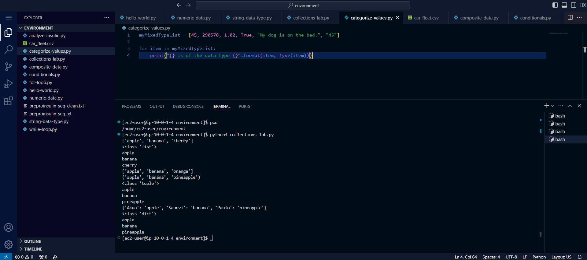
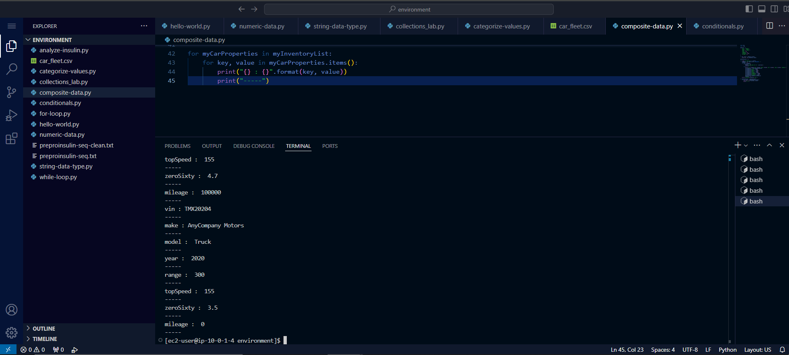
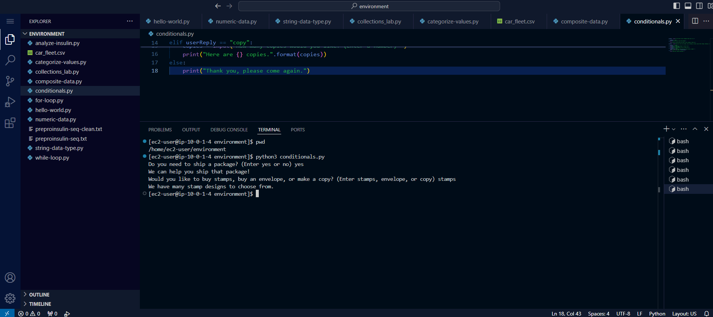
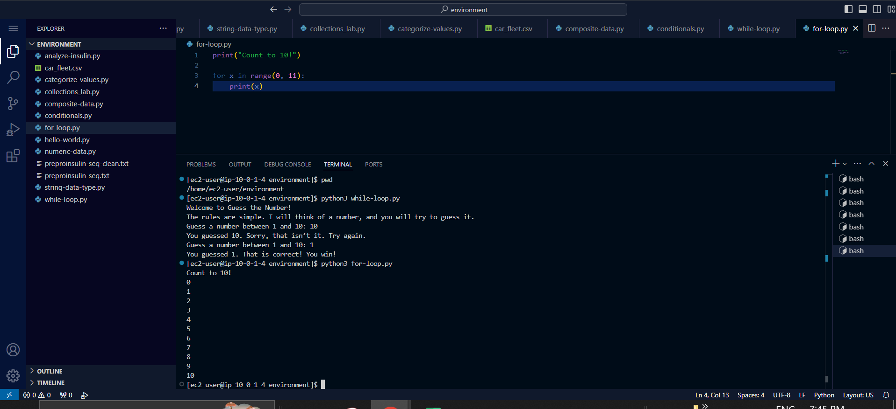
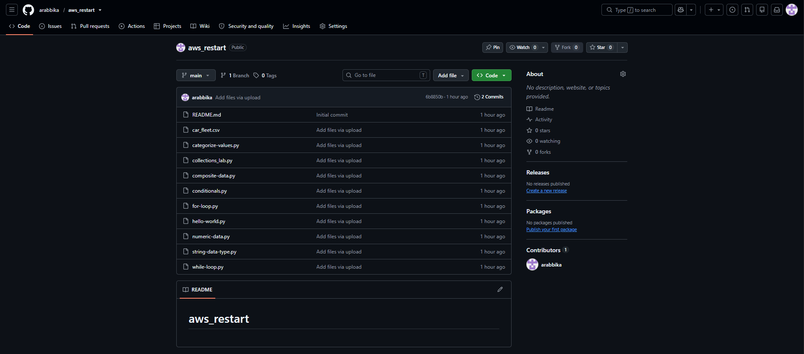
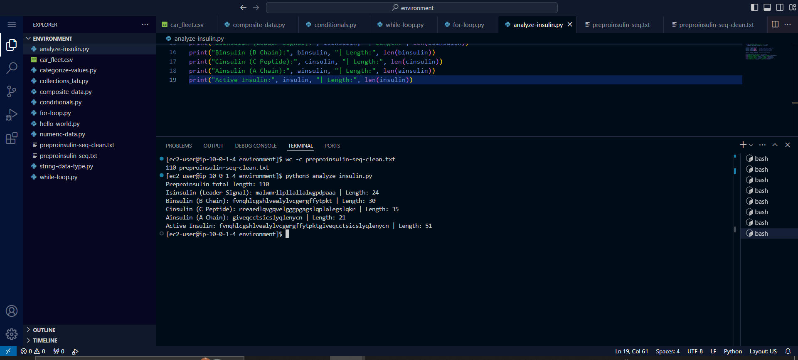

# Python & Developer Fundamentals

## 🎯 Project Goal
The goal of this project was to establish core software development competencies using Python and modern cloud development environments. I practiced writing clean, modular Python scripts, handling structured data, implementing complex control flow and sequence algorithms, and configuring version control workflows to manage code artifacts securely in remote GitHub repositories.
---

## 🛠️ Environment & Prerequisites
* **IDE / Platform:** AWS Cloud9 / VS Code Server
* **Language:** Python 3.11+
* **Version Control:** Git & GitHub
* **OS:** Amazon Linux (`ec2-user`)

---

## 📁 Repository Overview & Lab Evidence

### 1. `hello-world.py`
* **Concepts:** Basic syntax, standard output, and script execution.
* **Overview:** Demonstrates the fundamental entry-point script using `print()` to output string data to the console.
* **Lab Evidence:**
  

---

### 2. `numeric-data.py`
* **Concepts:** Numerical data types (`int`, `float`, `complex`), arithmetic operators, and type casting.
* **Overview:** Evaluates fundamental mathematical operations and examines how Python handles numerical precision across different data types.
* **Lab Evidence:**
  

---

### 3. `string-data-type.py`
* **Concepts:** String creation, concatenation, escape sequences, dynamic prompts, and f-string / `.format()` interpolation.
* **Overview:** Interactively collects user text inputs and formats structured string outputs.
* **Lab Evidence:**
  

---

### 4. `collections_lab.py`
* **Concepts:** Lists, tuples, and dictionaries.
* **Overview:** Implements indexed data collections, enforces element immutability rules, and performs key-value dictionary lookups.
* **Lab Evidence:**
  

---

### 5. `categorize-values.py`
* **Concepts:** Mixed-type lists, dynamic type checking with `type()`, and `for` loops.
* **Overview:** Iterates through a heterogeneous list containing integers, floats, booleans, and strings, displaying each value alongside its runtime data type.
* **Lab Evidence:**
  

---

### 6. `composite-data.py` & `car_fleet.csv`
* **Concepts:** File I/O, tabular CSV parsing, deep copying (`copy.deepcopy`), and nested collection structures.
* **Overview:** Reads structured vehicle fleet data from a CSV file, populates dictionary templates using deep copies, and constructs a manageable list of complex data items.
* **Lab Evidence:**
  

---

### 7. `conditionals.py`
* **Concepts:** Control flow (`if`, `elif`, `else`), logical comparison operators, and branching paths.
* **Overview:** Implements decision-tree logic based on dynamic user responses to simulate a postal service workflow.
* **Lab Evidence:**
  

---

### 8. `while-loop.py` & `for-loop.py`
* **Concepts:** Indefinite iteration (`while`), deterministic iteration (`for`), sequence generation using `range()`, and the `random` module.
* **Overview:** 
  * `while-loop.py`: Executes an interactive number-guessing game that prompts continuously until a correct guess is made.
  * `for-loop.py`: Performs sequence iteration to count deterministically from 0 to 10.
* **Lab Evidence:**
  

---

### 9. Version Control & GitHub Integration (`aws_restart`)
* **Concepts:** Git local setup, cloud remote creation, workspace extraction, file staging, committing, and uploading artifacts.
* **Overview:** Initialized a private repository (`aws_restart`) on GitHub with a default `README.md`. Exported local environment lab files (`.py` and `.csv`) and committed them to remote source control.
* **Lab Evidence:**
  

---

### 10. `analyze-insulin.py`, `preproinsulin-seq.txt`, & `preproinsulin-seq-clean.txt`
* **Concepts:** File cleaning, string slicing, sequence length validation (`len()`), and biological sequence extraction.
* **Overview:** Processes raw preproinsulin origin data by stripping non-amino acid formatting characters down to a 110-character clean string. Employs Python slice notation to isolate specific functional domains:
  * **Leader Signal (Isinsulin):** Amino acids 1–24 (Length: 24)
  * **B Chain (Binsulin):** Amino acids 25–54 (Length: 30)
  * **C Peptide (Cinsulin):** Amino acids 55–89 (Length: 35)
  * **A Chain (Ainsulin):** Amino acids 90–110 (Length: 21)
  * **Active Insulin:** Concatenated B Chain + A Chain (Length: 51)
* **Lab Evidence:**
  

---

## 🚀 How to Run Scripts

1. **Clone the repository:**
   ```bash
   git clone [https://github.com/arabbika/aws_restart.git](https://github.com/arabbika/aws_restart.git)
   cd aws_restart
