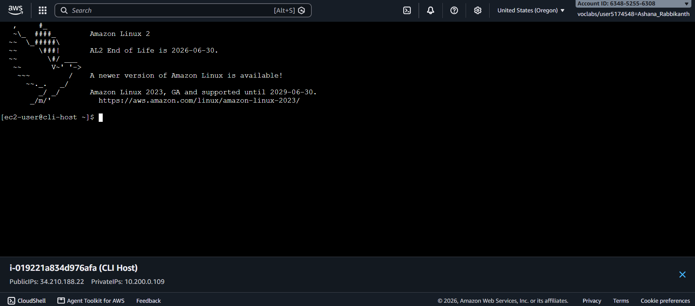
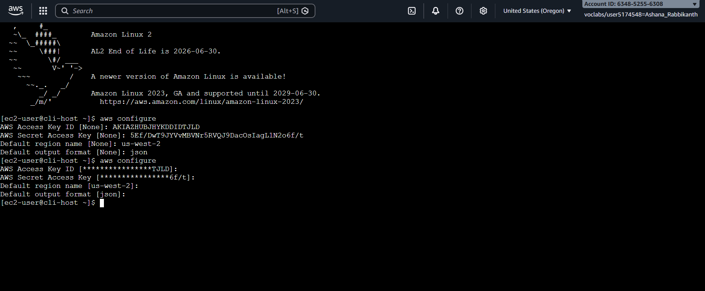
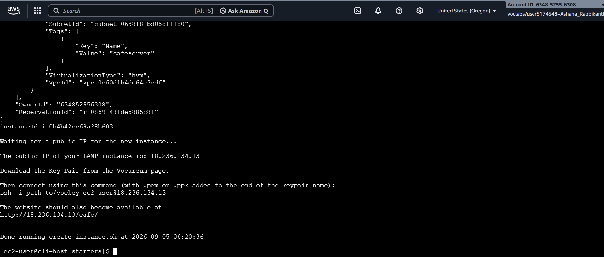
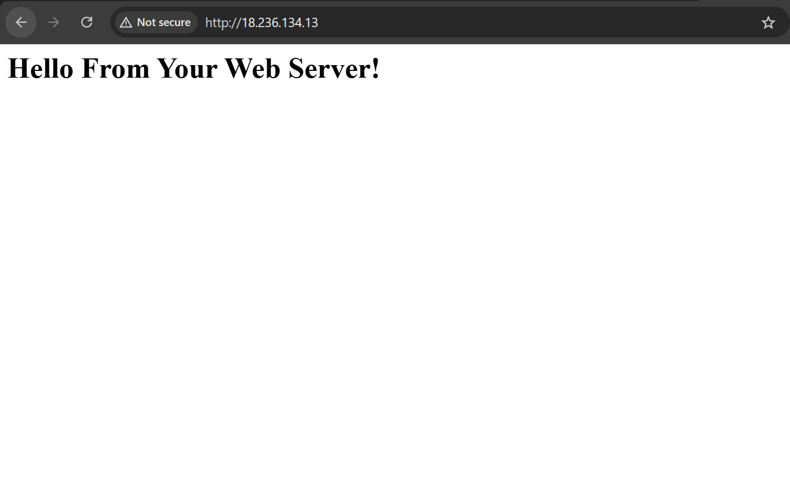
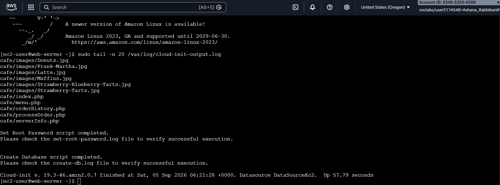
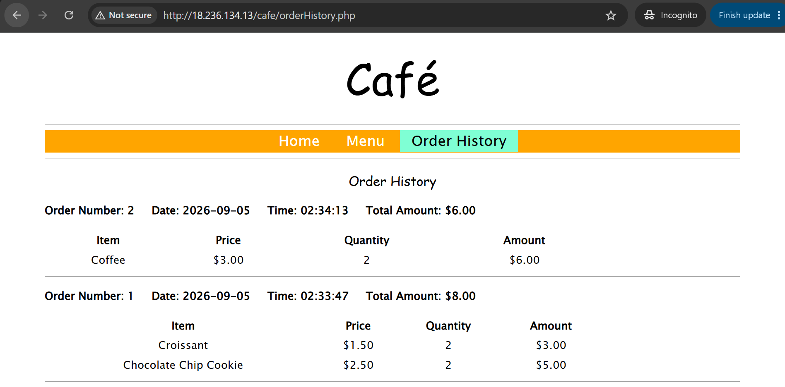

# AWS Bash Automation & Script Troubleshooting

**Course ID:** 173-[JAWS]-Activity

---

## Lab Goal
The goal of this project was to diagnose, debug, and correct a broken AWS CLI Bash script designed to automate the deployment of a LAMP stack EC2 instance (`cafeserver`). I analyzed script execution logs, fixed AWS SSM parameter lookup logic, corrected regional mismatch errors, and updated broken CLI command parameters to achieve a fully automated server deployment.

---

## How it Works
* **SSM Parameter Retrieval:** I fixed the script's parameter lookup logic to query the correct Amazon Linux 2 AMI ID directly from AWS Systems Manager (SSM) Parameter Store using `--query 'Parameter.Value' --output text` rather than relying on flawed string parsing logic.
* **Regional Consistency:** I updated hardcoded region parameters across AWS CLI commands to dynamically target the active deployment region (`us-west-2`), resolving resource lookup mismatches for subnets, security groups, and AMIs.
* **Automated Provisioning:** Once the CLI syntax and parameter bindings were resolved, the script successfully generated the security group, opened necessary inbound ports (22 and 80), and launched the EC2 instance with an active user data startup script.

---

### Lab Evidence

| Task | Delivery Check | Evidence |
| :---: | :--- | :--- |
| **1** | Environment Setup & AWS CLI Configuration |      |
| **2** | Script Execution & EC2 Launch Success |      |
| **3** | User Data Initialization & Application Verification |      |

---

## Lessons Learned & Optimization
* **Direct CLI Parameter Queries vs. Shell Parsing:** The original script attempted to use `aws ssm get-parameters` with complex `grep`, `cut`, and `sed` pipelines to extract the AMI ID. This broke easily when JSON output formats changed or returned parameter path strings. Refactoring the command to use `aws ssm get-parameter` paired with built-in `--query 'Parameter.Value' --output text` simplified the code and ensured reliable string return values.
* **Regional Alignment Across CLI Operations:** Hardcoding static regions (like `us-east-1`) inside automation scripts causes cascading failures when running in non-default regions like `us-west-2`. Ensuring every sub-command dynamically inherits the `$region` variable guarantees that dependent resources—such as AMIs, subnets, and security groups—exist in the target environment.
* **Production Deployment Hardening:** For a production deployment, I would add robust error handling to validate that the retrieved AMI ID exists before invoking `aws ec2 run-instances`. Additionally, I would store the user data script in an S3 bucket or version-controlled repository to decouple instance initialization logic from the deployment script itself.

---

## Technical Competence
* AWS CLI Shell Scripting & Automation
* Systems Manager (SSM) Parameter Store
* EC2 Instance & Security Group Management
* Bash Debugging & Parameter Substitution
* VPC Subnet & Region Scoping
