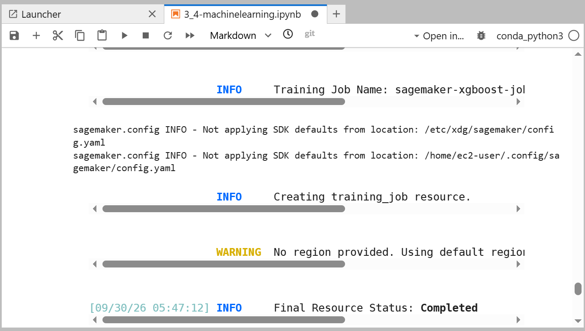

# Amazon SageMaker - Training a Machine-Learning Model

**Course ID:** 316-[AI]-Lab

---

## 🎯 Project Goal
The goal of this project was to move away from local machine learning workflows and leverage fully managed cloud infrastructure to train a predictive model. I practiced splitting a structured biomedical dataset into distinct training, validation, and test subsets, formatting data to meet algorithm input specifications, and launching an automated training job in Amazon SageMaker using the built-in XGBoost algorithm.

---

## ⚙️ How it Works
* **Stratified Data Splitting:** I loaded the biomechanical vertebral column dataset using Python and applied scikit-learn's `train_test_split` with stratification to ensure balanced class representation across training, validation, and test subsets.
* **Format Optimization for XGBoost:** Because the XGBoost container requires the target variable to reside strictly as the very first column in the dataset without headers or index values, I reordered the DataFrame and exported clean CSV buffers.
* **Amazon S3 Integration:** I wrote a modular Python function using Boto3 to upload the training and validation splits directly into dedicated S3 bucket folders, establishing clean data channels for the training estimator.
* **Managed Cloud Training:** I initialized an Amazon SageMaker model trainer using the built-in XGBoost container image, configured binary logistic hyperparameters with AUC evaluation metrics, and executed a training job on an `ml.m5.4xlarge` managed instance.

---

### 📊 Lab Evidence

| Task | Delivery Check | Evidence |
| :---: | :--- | :--- |
| **1 & 2** | Data Preparation, S3 Upload & SageMaker XGBoost Training Execution |  |

---

## 💡 Lessons Learned & Optimization
* **Column Positioning Nuances:** Early on, I learned that gradient boosting algorithms in cloud containers are strict about input schemas. Ensuring the target class label was explicitly moved to index position zero prevented silent parsing errors and mismatch exceptions during the training initialization phase.
* **The Value of Data Channels:** Keeping training and validation datasets separated into distinct S3 channels allowed SageMaker to evaluate performance metrics iteratively across boosting rounds, giving immediate visibility into model convergence without mixing datasets.
* **Production Scaling:** If I were expanding this project for a clinical production environment, I would incorporate SageMaker Automatic Model Tuning (Hyperparameter Optimization) to dynamically test learning rates and maximum tree depths. I would also couple the trained model artifact with SageMaker Model Monitor to track data drift over time as new patient records come in.

---

## 🛠️ Technical Competence
* Amazon SageMaker Managed Training Jobs
* XGBoost Gradient Boosting Configuration
* Stratified Dataset Splitting & Preprocessing
* Amazon S3 Data Channel Architecture
* IAM Execution Role Resolution in Jupyter Notebooks
* Hyperparameter & Evaluation Metric Tuning
