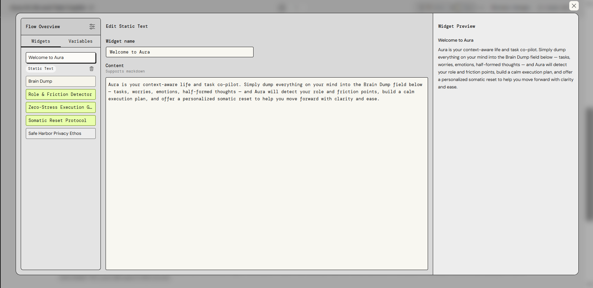
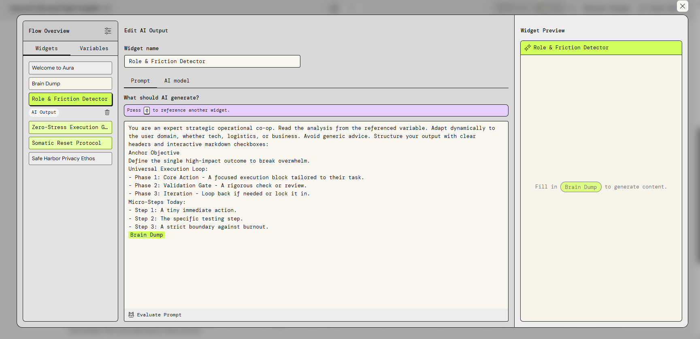
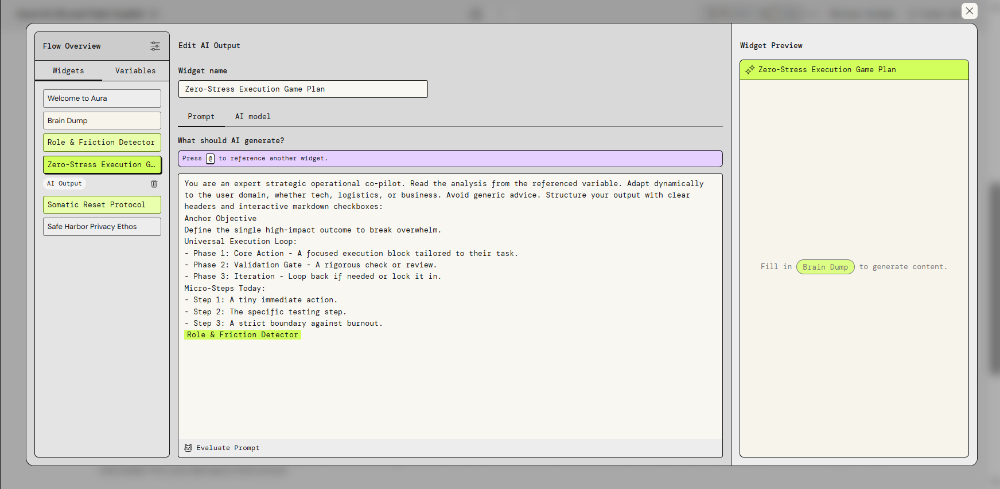
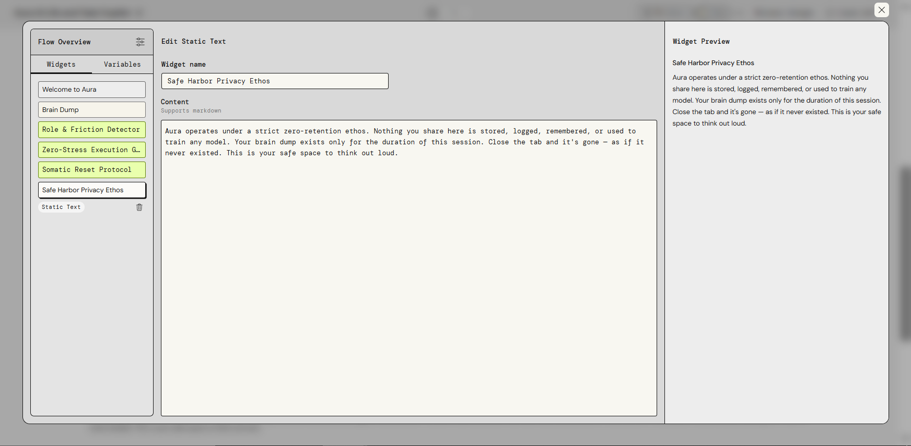
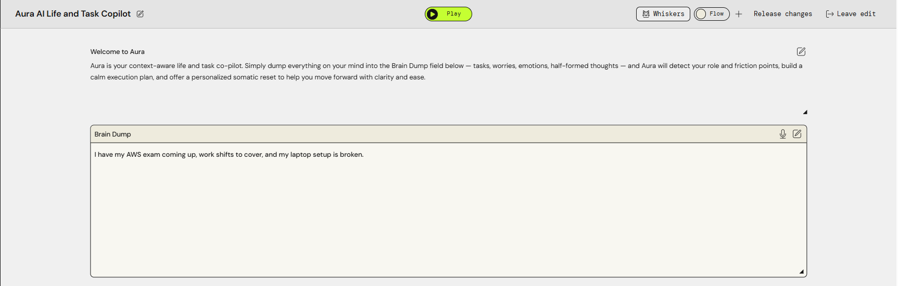
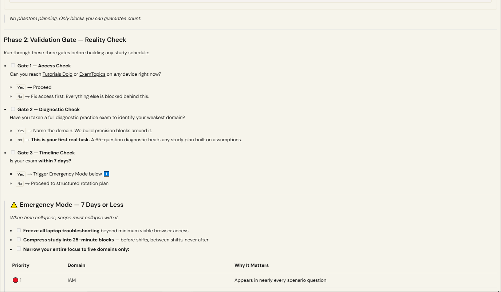
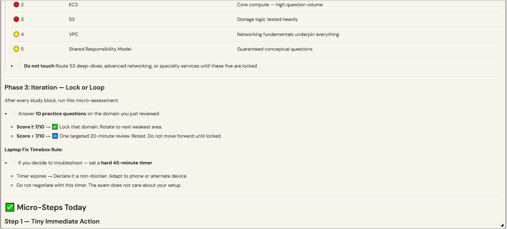
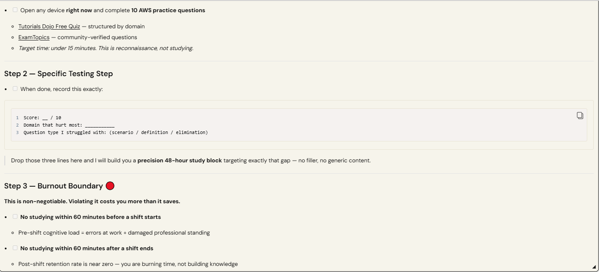
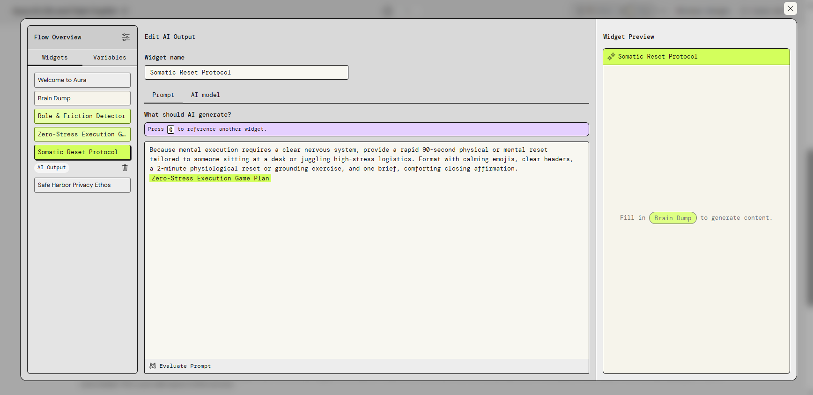

# Aura AI — Life, Study & Operational Co-Pilot

## 1. Business Case & Problem

Modern professionals, students, and small business owners don't fail from a lack of hard work—they fail from **cognitive gridlock**. When faced with simultaneous pressures (such as AWS technical certifications, multi-client retainer emergencies, household logistics, or cash-flow crunches), the human brain often misreads *simultaneity* as *impossibility*, leading to complete paralysis.

Standard generative AI tools (like raw ChatGPT) tend to make this worse by offering toxic-positivity advice, generic to-do lists, or vague hustle-culture motivation that requires the user to do heavy mental lifting just to sort through the response.

The opportunity is to build an intelligent, multi-domain operational co-pilot that acts as a strategic buffer: stripping away panic, analyzing real deadlines, and sequencing immediate execution loops.

To solve this, I designed **Aura**, an interactive generative AI application built on AWS PartyRock that transforms chaotic "brain dumps" into structured, zero-stress operational game plans.

---

## 2. Solution Design & Architecture

**Aura** uses a chained multi-block generative pipeline to ingest raw user overwhelm and output structured, role-agnostic execution steps.

### Core Pipeline Flow

```text
[ Brain Dump Input ]
        │
        ▼
[ Role & Friction Detector ] (Analyzes underlying domain & emotional drag)
        │
        ▼
[ Zero-Stress Execution Game Plan ] (Sequences reality map & 3-phase execution loop)
        │
        ▼
[ Somatic Reset Protocol ] (Physiological grounding & nervous system down-regulation)

### The Universal Execution Loop
Every output generated by Aura follows a strict, repeatable operational framework:
1. **The Anchor Objective:** Identifies the single high-impact outcome that breaks the logjam.
2. **Phase 1 (Core Action):** A low-friction, highly specific sprint tailored to the exact domain (tech study, logistics, or business finance).
3. **Phase 2 (Validation Gate):** Rigorous checkpoints and risk-filters before committing to a deliverable.
4. **Phase 3 (Iteration Protocol):** Clear pivot logic for handling pushback or stalling.

---

## 3. Responsible AI & Parser Safeguards

Building a deterministic workflow inside a generative playground requires strict guardrails against strict syntax parsers and hallucinations.

### Key Technical Challenges Overcome
* **PartyRock Parser Errors:** Solved variable data-pipelining crashes by eliminating bracketed placeholders (`[...]`) and quotation marks that trigger syntax validation flags in UI widgets.
* **Raw Text Echoing:** Refined system prompts to instruct blocks to process input variables "quietly" rather than spitting back raw user dumps.

### Responsible AI Principles
* **Burnout Protection:** Built-in hard boundaries that explicitly tell users when to stop working, archive automated noise, and close the laptop.
* **Context Agnosticism:** Stripped out generic advice to ensure the AI adapts to the user's actual physical constraints (e.g., deadline physics vs. perceived urgency).

---

## 4. Generative AI Approach & Prompt Engineering

Aura avoids generic chatbot responses by utilizing role-agnostic behavioral framing and structured markdown templates.

### Core Prompt Architecture
* **System Persona:** Acts as an expert strategic operational co-pilot.
* **Interactive Elements:** Utilizes native markdown checkboxes (`- [ ]`) so users can actively track their progress through completion loops.
* **Dynamic Adaptation:** Automatically scales its tone from enterprise cash-flow triage down to everyday social/family logistics based entirely on the user's input variables.

---

## 5. AWS Architecture & Implementation

Aura was architected and deployed natively within **AWS PartyRock**, leveraging Amazon Bedrock foundational models underneath a managed serverless graph environment.

```text
User Input (Web / Mobile)
            │
            ▼
   AWS PartyRock Frontend
            │
            ▼
    Managed Application Graph
            │
 ┌──────────┴──────────┐
 ▼                     ▼
Upstream Widget    Downstream Variable Pipelining
(Brain Dump)       (Role & Friction Detector)
            │
            ▼
    Amazon Bedrock Model Foundation
            │
            ▼
   Structured Markdown Output (Zero-Stress Execution Plan)


### Key Components
* **AWS PartyRock Environment:** Provides the rapid application prototyping and graph architecture layer.
* **Amazon Bedrock Foundation Models:** Powers contextual understanding, multi-domain reasoning, and structured markdown generation.
* **Widget-to-Widget Data Pipelining:** Connects distinct text blocks securely using UI variable pickers.

---

## 6. Live App & Demonstration

Want to test-drive Aura yourself? 

* 🚀 **Try the Live App:** [Aura AI on AWS PartyRock](https://partyrock.aws/u/arabbika/BE5SQ_NkM/Aura-AI-Life-and-Task-Copilot)

### Test Scenarios to Try in the "Brain Dump" Block:
1. **The Tech Study Squeeze:** *“I have my AWS exam coming up, work shifts to cover, and my laptop setup is broken.”*
2. **The Small Business Crisis:** *“My cash flow is tight, commercial quotes are overdue, and my supplier put my account on a credit hold.”*
3. **Everyday Logistics:** *“I'm juggling family errands and urgent client tickets while feeling completely overwhelmed.”*

---
## 7. Project Screenshots

### Flow Architecture Canvas
*A clean visual representation of the multi-block pipeline connecting input to execution.*


### Flow Overview & Widget Configurations
*Configuring the sequential blocks and markdown prompt structures in PartyRock.*





### Live App Execution & Outputs
*Sample execution plans generated by Aura handling complex study and operational crises.*


#### Zero-Stress Execution Game Plan (Full Sequential Output)
*(The following four screenshots stack sequentially to display the full, continuous operational output)*







---

## Final Reflection

Building Aura as part of my cloud practitioner training taught me that cloud architecture isn't just about spinning up servers—it's about designing systems that solve real human friction. By combining structured prompt engineering with clean workflow pipelining in AWS, Aura turns overwhelming chaos into clear, actionable momentum.
