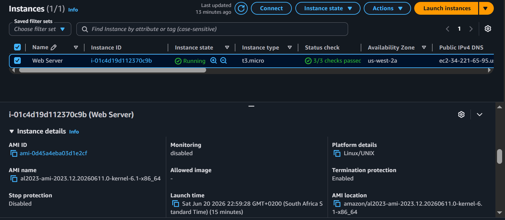

# ◈ EC2 Foundations and Provisioning
**Course ID**: `11-[CF]-Lab`

## 🎯 Architectural Objective
Establishing a foundational compute environment to master instance lifecycle management, security group orchestration, and vertical scaling (compute/storage) within AWS.

## ⚙️ Technical Implementation
* **Compute:** Provisioned a `t3.micro` instance using Amazon Linux 2023, initialized with a User Data script to automate the deployment of an Apache web server.
* **Network & Security:** Implemented a "Least Privilege" security model by explicitly configuring an Inbound Rule to permit HTTP traffic (Port 80) only after validating that the initial web request failed due to lack of permission.
* **Lifecycle & Scaling:** * Performed vertical scaling by transitioning the instance type from `t3.micro` to `t3.small`.
    * Executed storage expansion by modifying the EBS root volume from `8 GiB` to `10 GiB` to accommodate increased resource needs.
    * Configured **Termination Protection** to prevent accidental resource deletion.

## 📷 Lab Evidence
| Task | Description | Evidence |
| :--- | :--- | :--- |
| **1** | Instance Launch & Status |  |
| **3** | Security Group Hardening |  |
| **4** | Vertical Scaling (Compute/Storage) |  |
| **5** | Resource Governance Test |  |

## 🛠️ Operational Intelligence (Troubleshooting)
* **Real-World Challenge:** Encountered a `Connection Refused` error when attempting to access the web server post-launch.
* **Engineering Resolution:** Identified that the security group lacked an explicit inbound rule for Port 80. Remedied this by updating the Security Group Inbound Rules to allow HTTP traffic, enabling successful web server access.
* **"What If" Scenario:** In a production environment, I would define the security group as **Infrastructure as Code (IaC)** using Terraform or CloudFormation to ensure consistent, repeatable network security configurations across environments.

## 📊 Technical Competence
* **Demonstrated Skills:** Security Group Management, Instance Lifecycle Control, Vertical Scaling (EBS & Compute), and Automated Provisioning via User Data.
